# Lab 1 - Administer and configure Dynamics 365 Contact Center

**Duration: 35 minutes**

**Introduction**

This lab focuses on configuring key Copilot Service capabilities in
Dynamics 365 Contact Center by using both the Copilot Service admin
center and the Power Platform admin center. Learners review channel
settings, manage user attributes, enable generative AI and productivity
features, configure agent experience settings, create a capacity
profile, and explore role persona mapping to prepare the environment for
more advanced service operations.

## Exercise 1 - Explore Channels in Copilot Service Admin Center

In this exercise, learners sign in to the Contact Center environment and
open the Copilot Service admin center to review the available channels.
They confirm the Microsoft 365 Copilot channel settings and become
familiar with where communication channels are managed for the
environment.

1.  Open a new private window. Use the URL that we extracted from the
    Power Platform admin center and log in to the Contact Center
    environment by using **Mark Brown's** credentials. Mark Brown is
    assigned the **System Administrator and Omnichannel Administrator roles.**

    > **Note:** If you have any confusion about the login. Revisit Exercise 4 of Lab 0.

    

2.  On the App selector, select **Copilot Service admin center** from
    the list of apps.

    

3.  Select **Channels** under **Customer Support** on the left
    navigation panel.

    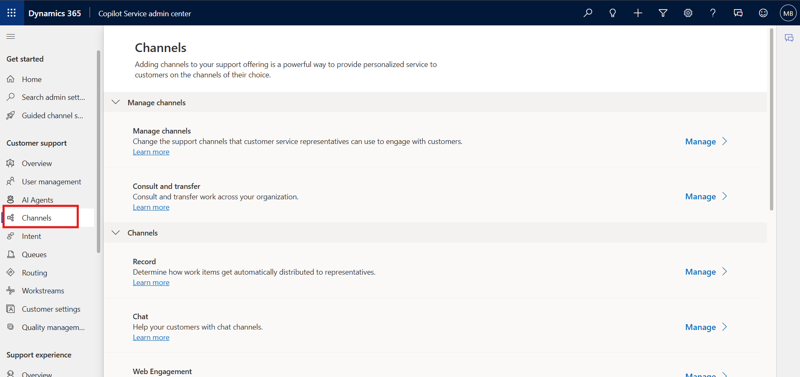

4.  Select **Manage** for **Manage channels**. The Manage Channels page
    appears.

    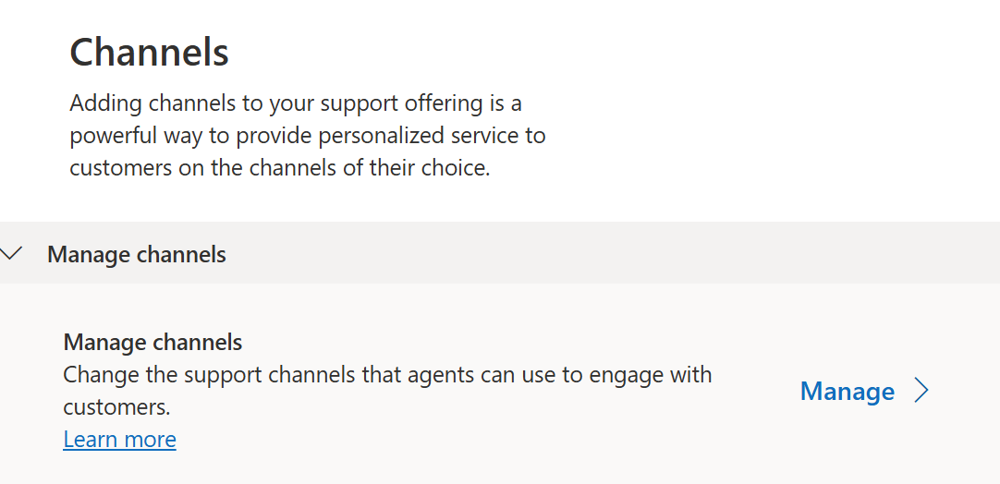

5.  You can view the channels that are enabled.

6.  Select the **Microsoft 365 Copilot (Preview) channel** check box and
    then click on the **Save** button.

    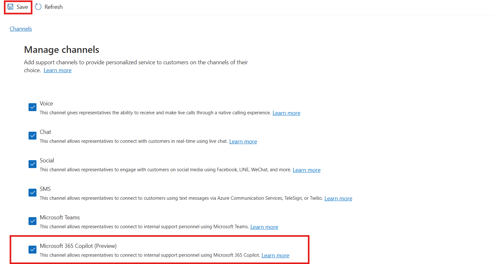

## Exercise 2 – Manage users and update attributes

This exercise focuses on managing user configuration in the Contact
Center environment. Learners review the enhanced user management
experience and update operational attributes such as skills, queues, and
capacity profiles to understand how user settings support routing and
assignment readiness.

1.  Select **User management** under **Customer support** in the site
    map.

    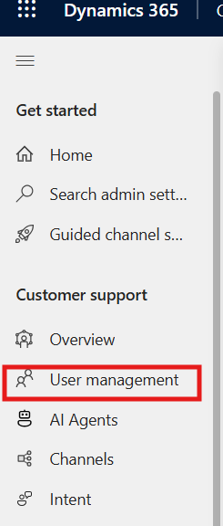

2.  On the page that appears, select **Manage** for **Enhanced user
    management**. The ‘**Contact center users’** view displays the users
    that have been configured in the Power Platform admin center.

    

3.  Hover the pointer over the rows of your **Mark Brown** users and
    select the check boxes.

    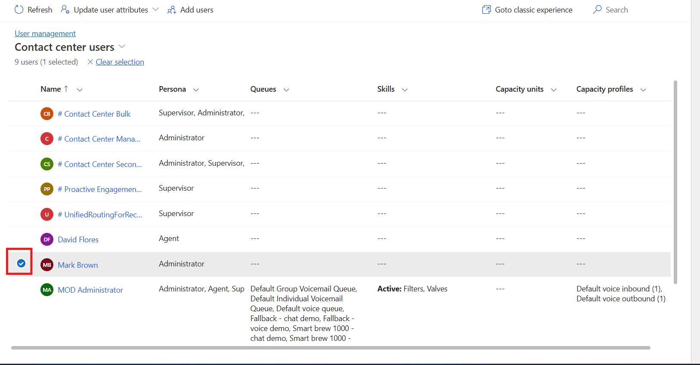

4.  To update user attributes, select **Update user attributes**, and
    you will see three options available. You can select one of the
    options based on your requirements.

    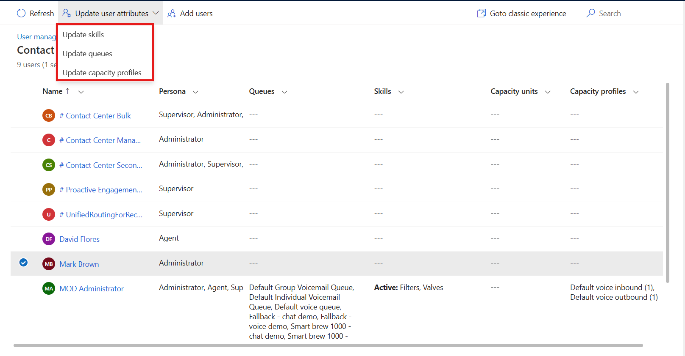

5.  **Update skills**: On the dialog box that appears, review and note
    the options available:

    1.  In the Skills field, select **Filter and Value**, then click on
        the **Add to all.**

        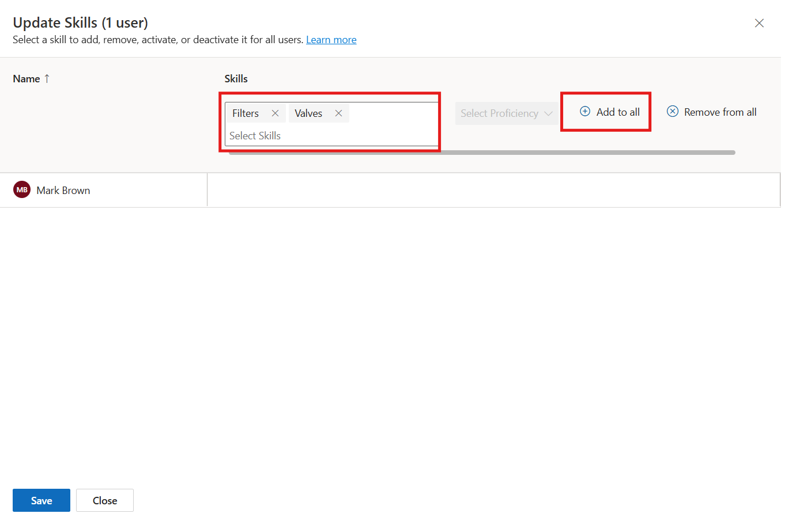

    2.  **Add skills to users:** In the **Skills** box, select the skills
        that you want to add, select proficiency, and then select **Add to
        all**. The selected skill and proficiency are added to the users
        list. To have a different proficiency in the skills, select one
        skill at a time.

    3.  **Activate or deactivate**: Select a skill in the **Skills box and**
        select the ellipses to select **Activate for all** or **deactivate
        for all**. Users with a deactivated skill will not be considered
        during assignment if the skill requirement of a work item matches
        the deactivated skill.

    4.  **Remove skills**: To remove a skill from the list of users, select
        the skill in the **Skills** box, and select **Remove from all**.
        Save your changes. The selected skills are removed for the users.

    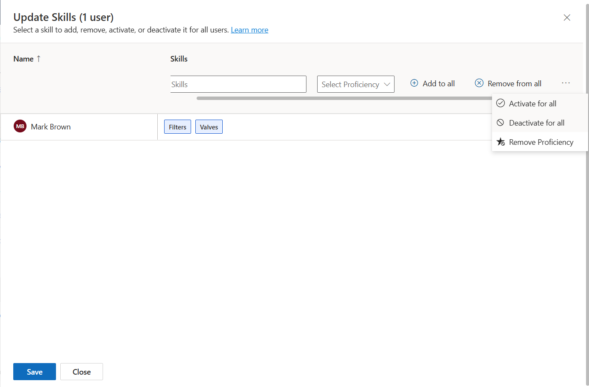

6.  Click on **Save,** then **Close**.

7.  Again select **Mark Brown** radio button **\> Update user attributes \> Update queues.**

8.  **Update queues**: Select all Default Queues and then click on the
    **Add to all.**

    

9.  On the dialog box that appears, in the **Queues** box, review and
    note the options available.

10. Click on **Save,** then **Close**.

    

11. Now perform step 7 again and select **the Update capacity profile**.

12. On this dialog box, in the **Capacity profiles** box, select all
    profiles, review and note the options available, and then click on
    the **Add to all**.

    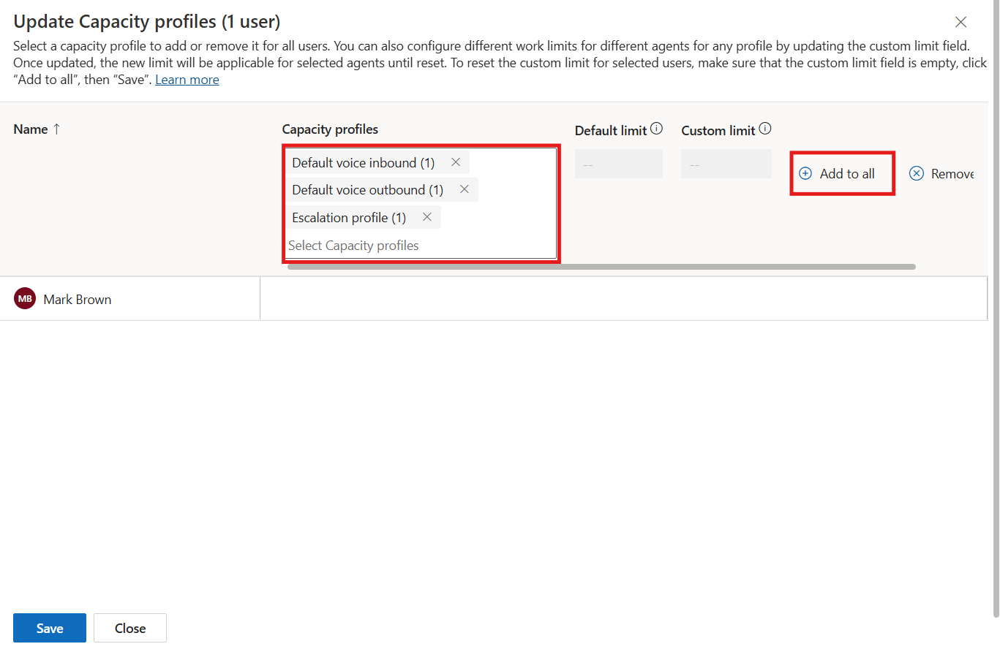

13. Click on **Save and** then **Close.**

    

## Exercise 3 - Enable Generative AI features in the Power Platform Admin Center

In this exercise, learners move to the Power Platform admin center to
review and enable generative AI settings for the Contact Center trial
environment. They examine the Generative AI features configuration and
confirm the required settings that support Copilot experiences across
the platform.

1.  Open a new tab in the browser. Sign in to the Power Platform admin
    center - !!https://admin.powerplatform.microsoft.com/!! With the
    **Mark Brown** credentials.

2.  From the left side panel, select the **Manage** option and then
    navigate to **Environments**.

    

3.  Select your **Contact Center Trial** environment.

    

4.  On the Power Platform admin center page, scroll down until you see
    the **Generative AI features** card. Now, select **Edit**.

    

5.  Review the terms of use and select the **Bing Search** checkbox if
    it is not selected. When the **Bing Search** feature is turned on,
    your copilot in Microsoft Copilot Studio can use the data sources
    you provided, but it can use Bing’s APIs to index the results better
    and find the best answer from within your data sources.

6.  If any changes have been made, select **Save** to confirm them;
    otherwise, select **Cancel**.

    

## Exercise 4 - Configure Copilot for questions and emails

This exercise introduces Copilot productivity settings for question
handling and email assistance. Learners enable the required options in
the Copilot Service admin center so agents can use Copilot features to
access knowledge and improve response workflows.

1.  Switch back to the **Copilot Service admin center** tab.

2.  Select **Productivity** under **Support experience**.

3.  Select **Manage** for **Copilot for questions and emails**.

    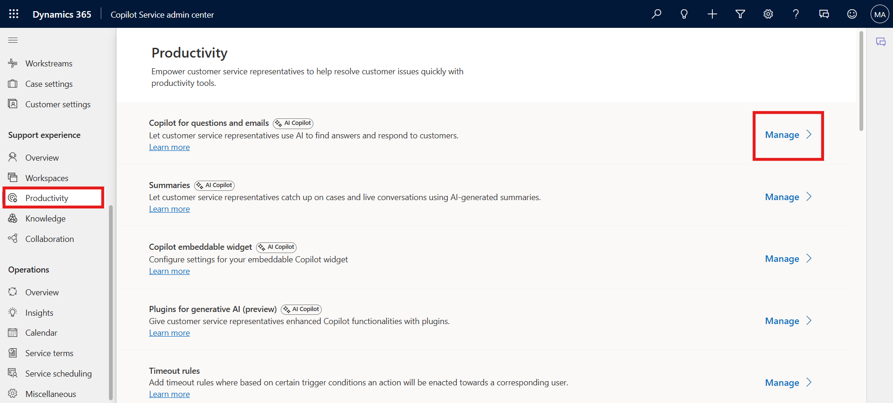

4.  Scroll down and select **Include a knowledge source base** check
    box.

    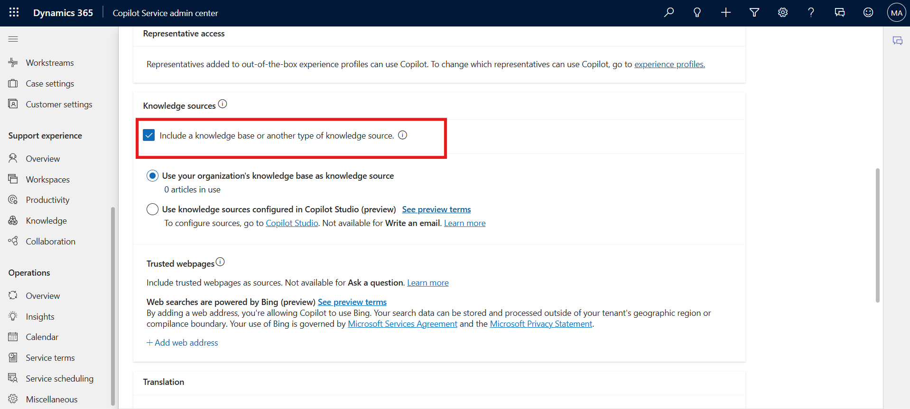

5.  Scroll up and then Select the checkbox for **Ask a question**.

6.  Select **Save and close**.

    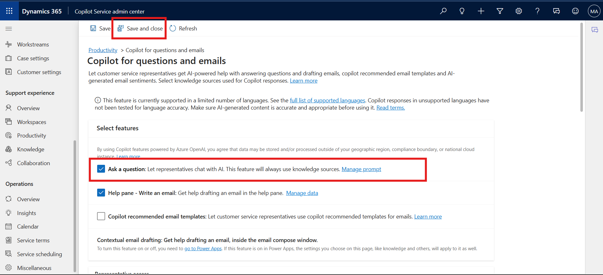

## Exercise 5 - Enable Copilot AI features in the agent Experience Profile

In this exercise, learners configure the agent experience profile to
make Copilot features available in the productivity pane. They review
the profile settings and confirm that the required AI capabilities are
enabled to support guided and efficient agent interactions.

1.  On the left navigation pane, under **Support experience,** select
    **Workspaces.**

2.  Select **Manage** under **Experience profiles.**

    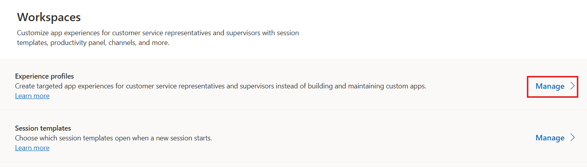

3.  Select the **Customer Service Trial profile** agent experience
    profile from the list.

    

4.  On the **Productivity Pane**, make sure **Copilot help pane** toggle
    is **ON** so that agents can use the Copilot features such suggest a
    response, ask a question, and write an email on the productivity
    pane.

    

5.  Scroll down to **Copilot AI features** section. Make sure that all
    the Copilot AI features are enabled (except Intent-based suggestions
    (preview))

    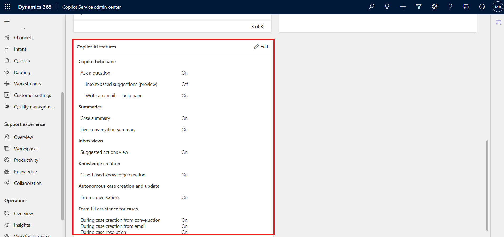

## Exercise 6: Create and assign a Capacity Profile

This exercise guides learners through creating a new capacity profile
and assigning it to a user. It helps them understand how capacity
settings control work item limits, reset behavior, and assignment
blocking within the Contact Center environment.

1.  On the Copilot Service admin center, select **User
    management** under **Customer support**.

    

2.  Select the **Manage** option for **Capacity profile**.

    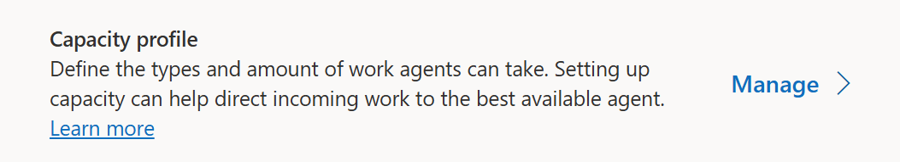

3.  On the **Capacity profiles** page, select **Create new**.

    

4.  On the **Details** tab of the **Create capacity profile** dialog
    box, enter the following details:

    - **Profile name**: Name for the capacity profile as !!Demo!!

    - **Work item limit**: Number of units of the work type that you can
      assign to the agent. – Enter - !!5!!

    - **Reset frequency**: Period after which capacity consumption is
      reset for agents. Select **Immediate**

    - **Note** - Once configured, you must recreate the capacity profile
      if you want to change the reset frequency.

    - **Assignment blocking**: Set the toggle to **Yes**. When the work
      item limit is met, the agent isn’t assigned a new work item
      automatically.

    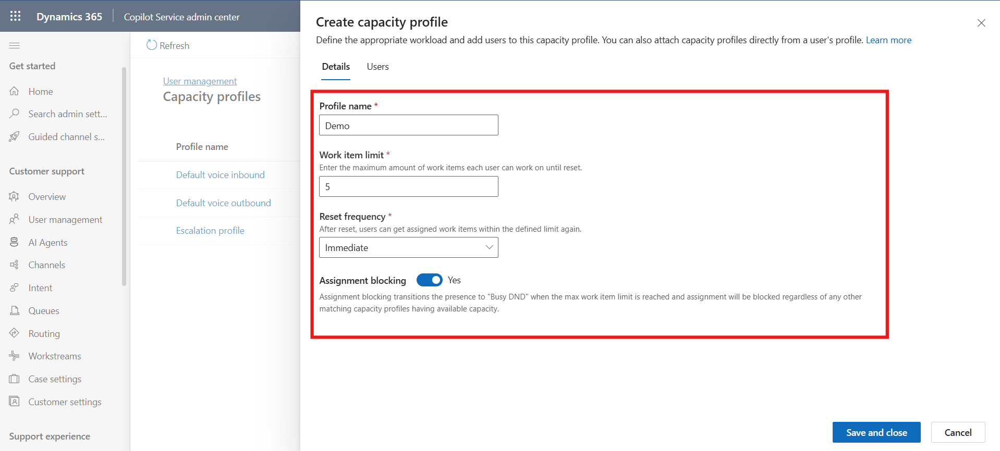

5.  Select the capacity profile created. Select the **Users** Tab and
    Select **Add user**

    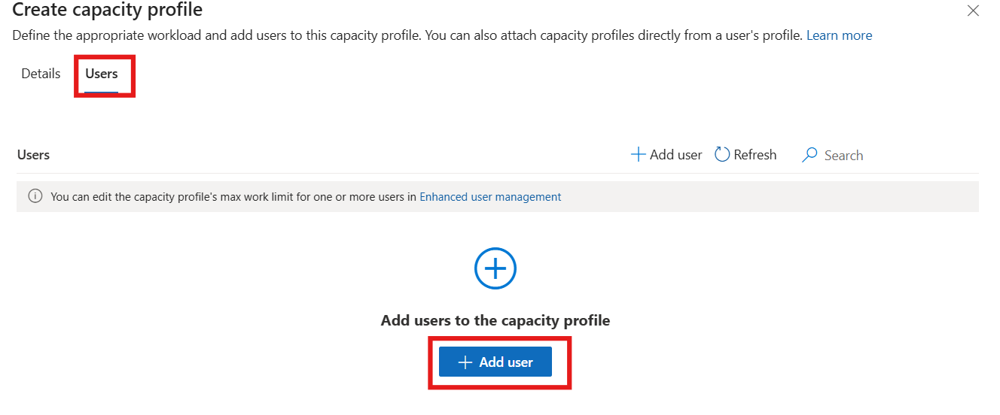

6.  Select the **MOD Administrator** check box and then click on **Add
    user.**

    

7.  Select **Save and Close.** The capacity profile is assigned to the
    admin user.

    

## Exercise 7: View and edit Role Persona Mapping

In this exercise, learners review the role persona mapping experience
and examine how security roles are associated with personas. This
provides an introduction to persona-based access design and shows how
role alignment can support administrative planning in the environment.

1.  On the left navigation pane, select **User
    management** in **Customer support** again.

2.  Select **Manage** for **Role persona mapping**.

    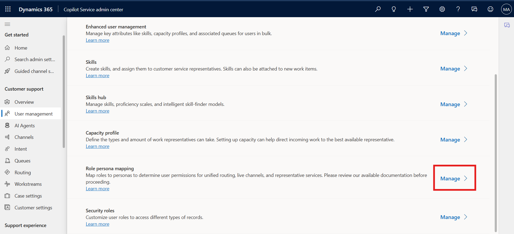

3.  Select the persona – **Admin** to add or remove security roles.
    The **Edit roles** pane displays the list of roles.

    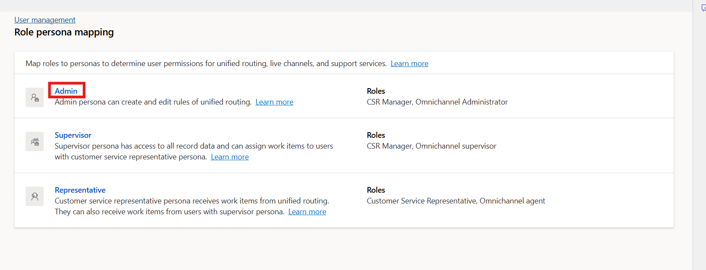

4.  Select or clear the selection from the checkboxes for the required
    security roles.

    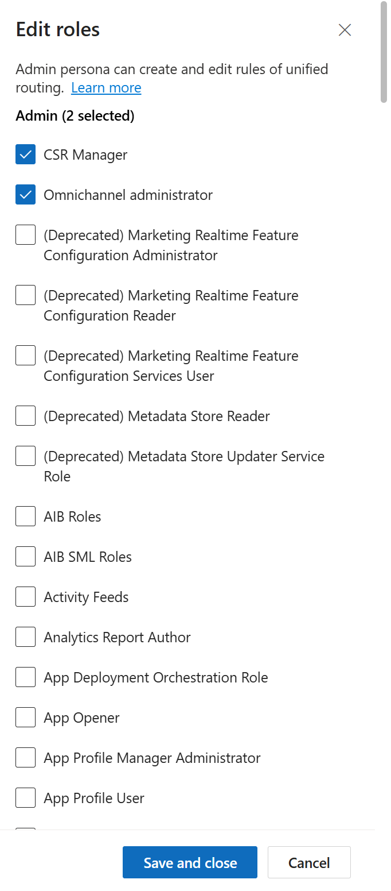

    > **Note** – For this lab, we are not adding or removing any roles for the persona.

5.  Select **Save and Close** after you have made any changes.

    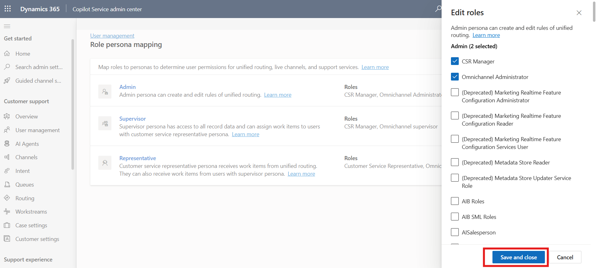

## Conclusion

This lab builds administrative knowledge for managing Copilot Service
features in Dynamics 365 Contact Center. By working across the Copilot
Service admin center and Power Platform admin center, learners review
channels, user configuration, AI settings, productivity controls,
experience profiles, capacity setup, and persona mapping. These
activities help establish the operational and AI configuration needed to
support agents and administrators in future Contact Center labs.
