# Lab 2 - Design intelligent routing with Workstreams, Queues, and Skills in Dynamics 365 Contact Center

**Duration: 45 minutes**

**Introduction**

This lab guide focuses on building the core work distribution setup in
Dynamics 365 Contact Center. Learners use the Contact Center environment
to create workstreams and queues, define routing and assignment logic,
and configure skill-based routing for agents. The exercises demonstrate
how customer conversations can be organized, prioritized, and directed
to the most appropriate users based on queue design, business
conditions, capacity rules, and skill requirements. By completing this
lab, learners gain practical experience in preparing a structured
support environment that improves routing accuracy and operational
consistency.

## Exercise 1: Sign In and Manage Workstreams

In this exercise, learners sign in to the Contact Center environment and
begin the workstream configuration process for inbound chat support.
They create a new messaging workstream and then review how an existing
workstream can be edited, copied, and deleted for ongoing
administration. This exercise establishes the channel foundation
required for handling customer conversations through a structured
support flow.

### Task 1 - Create a New Workstream

1.  Open new private window. Use the URL that we extracted from the
    Power Platform admin center and log in to the Contact Center
    environment by using **Mark Brown's** credentials. Mark Brown is
    assigned the **System Administrator and Omnichannel Administrator
    roles.**

    > **Note:** If you have any confusion about the login. Revisit Exercise 4 of Lab 0.

    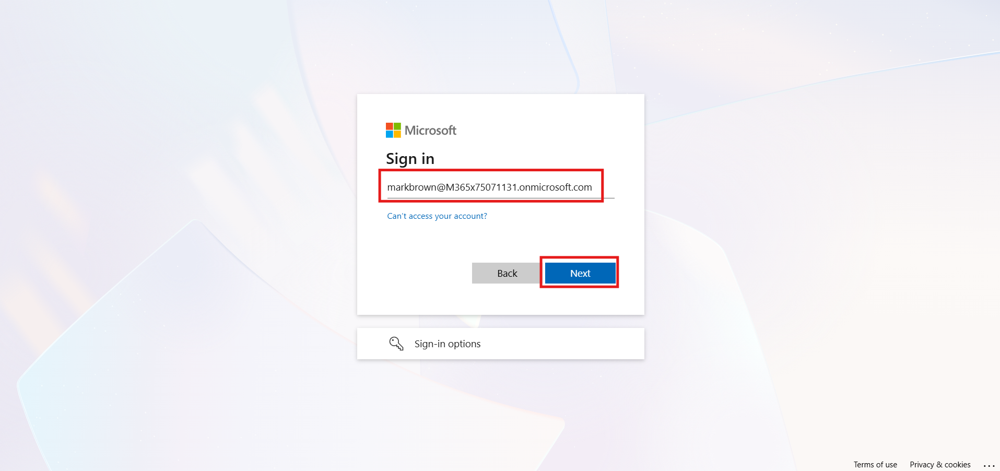

2.  On the App selector, select **Copilot Service admin center** from
    the list of apps.

    

3.  In the site map of the **Copilot Service Admin center**, select
    **Workstreams** under **Customer support**.

    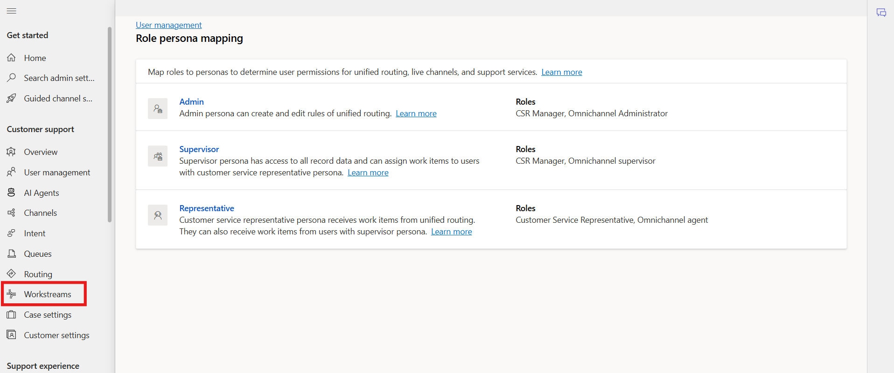

4.  Select + **New workstream** from top of the screen.

    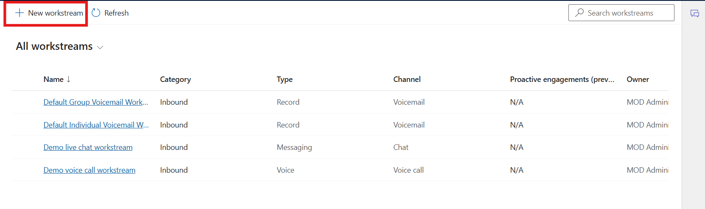

5.  On the **Create a workstream** dialogue, select Inbound and then
    select **Next**.

    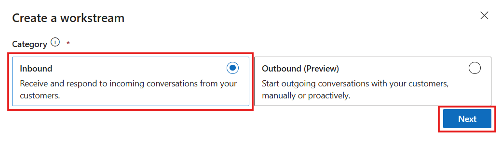

6.  Enter the following details:

    - **Name**: Enter an intuitive name - !!Contoso chat workstream!!

    - **Type**: Select **Messaging**

    - **Channel**: This box appears if you select the type
      as **Messaging**. Select **Chat**

    - Select **Persistent** **Chat** checkbox.

    - **Work distribution mode**: Select **Push** 

    - In **Fallback queue** – Select **Choose existing**: Select Default
      messaging queue (All users)

    - Select **Create**.

    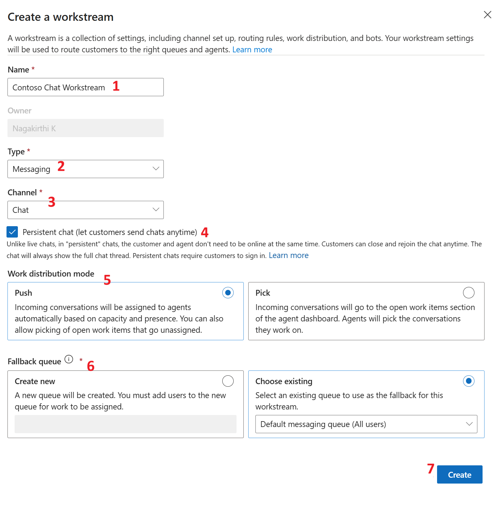

    The workstream that you created is displayed with the option to
    configure the selected channel instance.

    

### Task 2 - Edit, Copy, and Delete a Workstream

1.  Select **Workstreams** on the left navigation pane under **Customer
    Support**.

2.  Select the **Contoso chat workstream** on the **All
    workstreams** page and select **Edit** on the command menu to edit
    the workstream.

    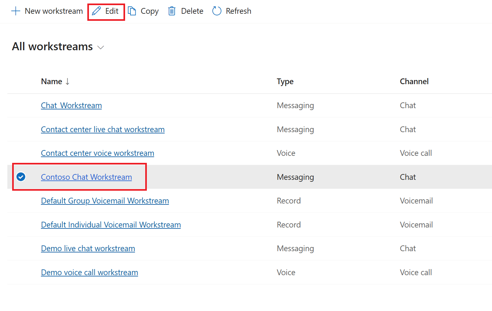

3.  To copy the **Contoso chat workstream**, select the workstream and
    click **Copy** on the command menu.

    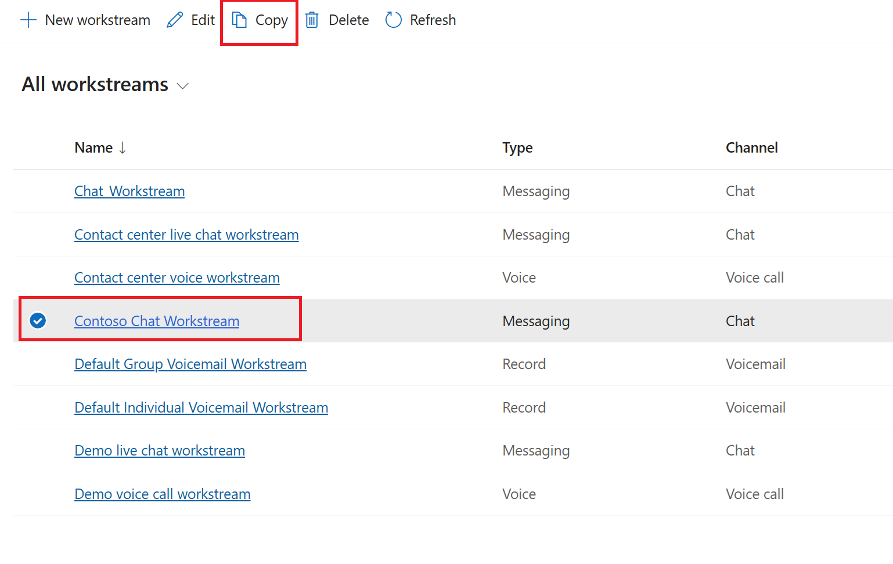

4.  Select **Copy** in the ***Do you want to copy this
    workstream?*** dialog.

    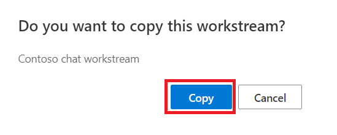

5.  The workstream is copied and inherits the settings of the workstream
    you copied from, including its name, prefixed with **Copy of Contoso
    chat workstream.**

    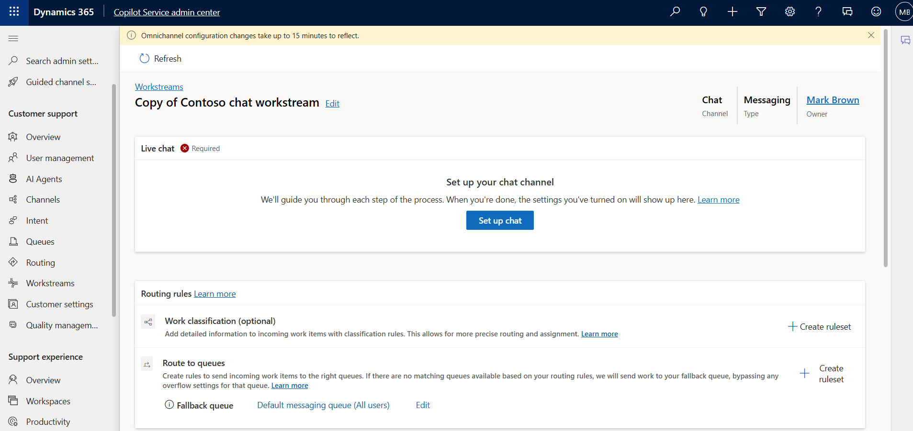

6.  To delete the workstream, select the workstream and click
    **Delete.**

    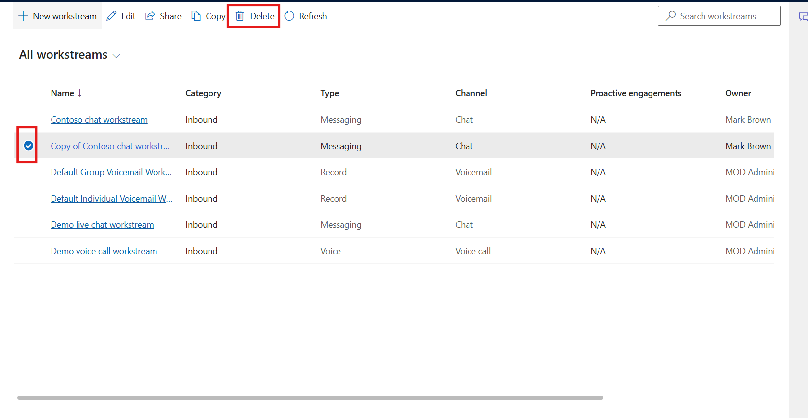

## Exercise 2: Create and Configure Queues

In this exercise, learners create and configure a queue to support
supervisor-based work distribution. They define the queue record, add
the required user, assign operating hours, and copy the queue for reuse.
This exercise shows how queues can be organized to support team
structure, availability planning, and operational readiness in the
Contact Center environment.

### Task 1 - Create and Configure a New Queue

1.  In the site map of the **Copilot Service admin center**,
    select **Queues** in **Customer support**.

2.  On the **Queues** page, select **Manage** for **Advanced queues**.

    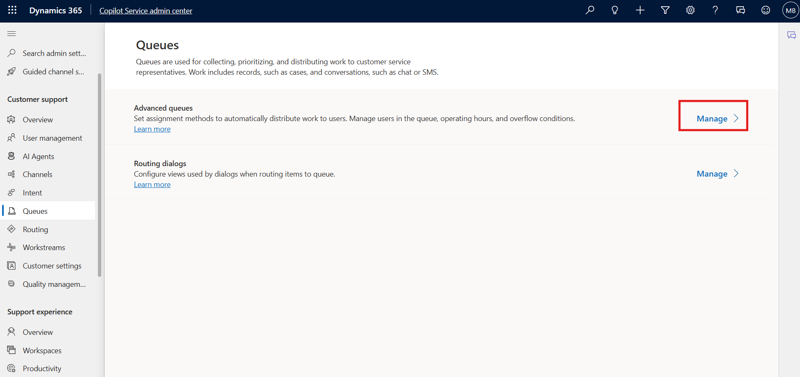

3.  On the **Queues** page, Select +**New** **Queue**

    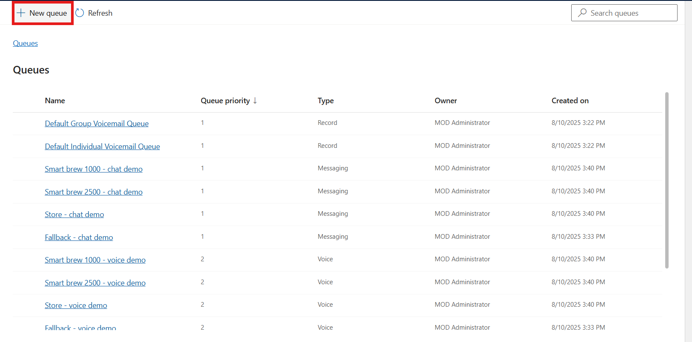

4.  In the **Create a queue** dialog, enter the following details:

    - **Name**: !!**Contoso queue for supervisors**!!

    - **Type**: Select **Messaging**

    - **Queue Priority**: !!**1**!!

    - Select **Create**

    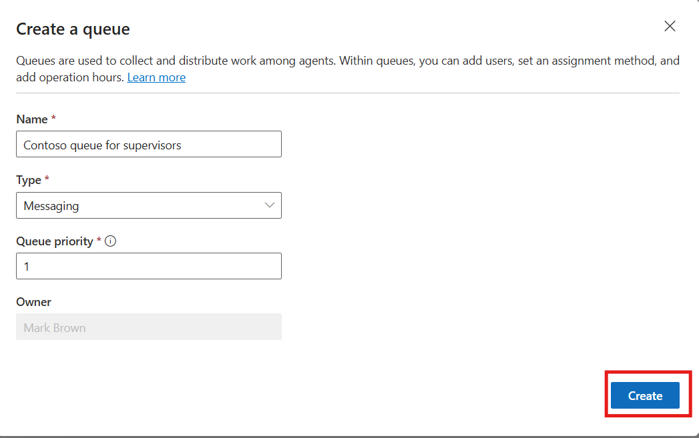

5.  The queue that you created is displayed.

6.  Select **Add users**, and in the flyout menu, select the **Remy
    Morris**, and then select **Add**.

    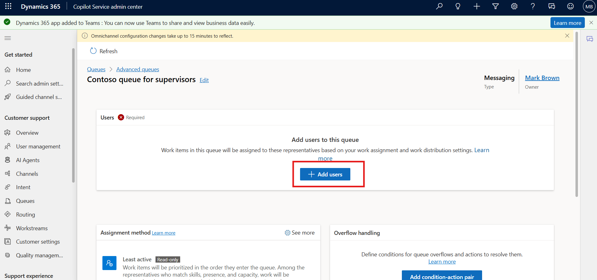

    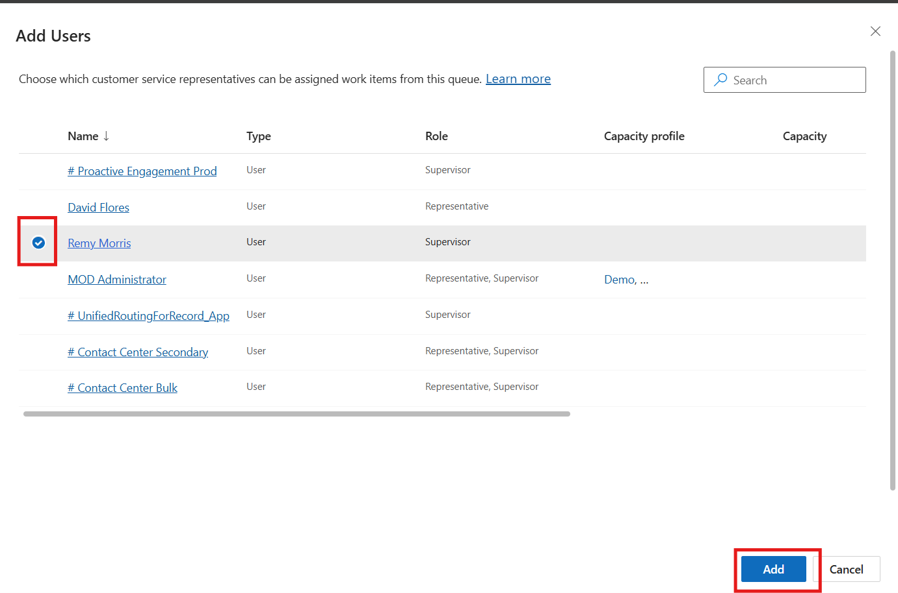

7.  Remy **Morris** is added to the queue.

    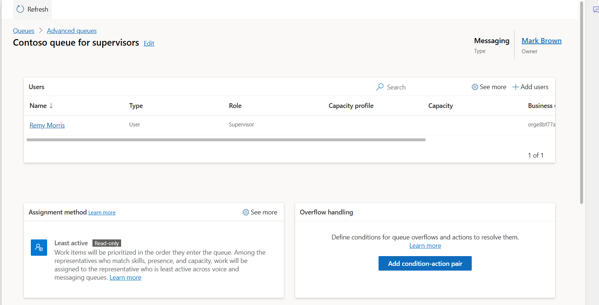

8.  To set the operating hours, in **Operation hours**, scroll down and
    select + **Set operation hours**.

    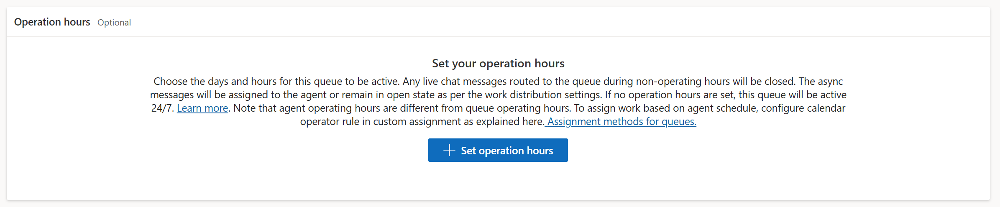

9.  On the **Set operation hours** dialog that appears, click the
    dropdown next to **Select operation hours** and then click **+
    Create new**.

    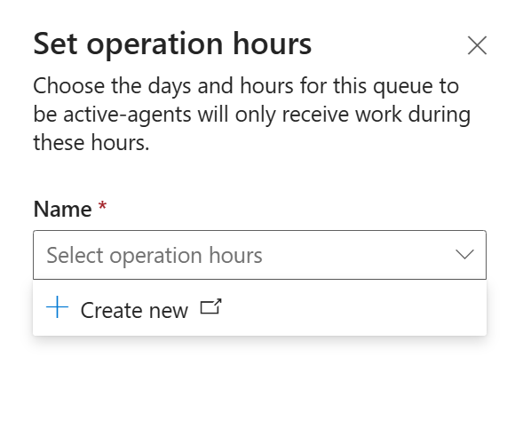

10. On the **New Operating Hour** page, enter !!**Contoso operation
    hours**!! in the **Name** field and **Description** field.

11. Click **Save & Close** to navigate back to the **Contoso queue for
    supervisors** page.

    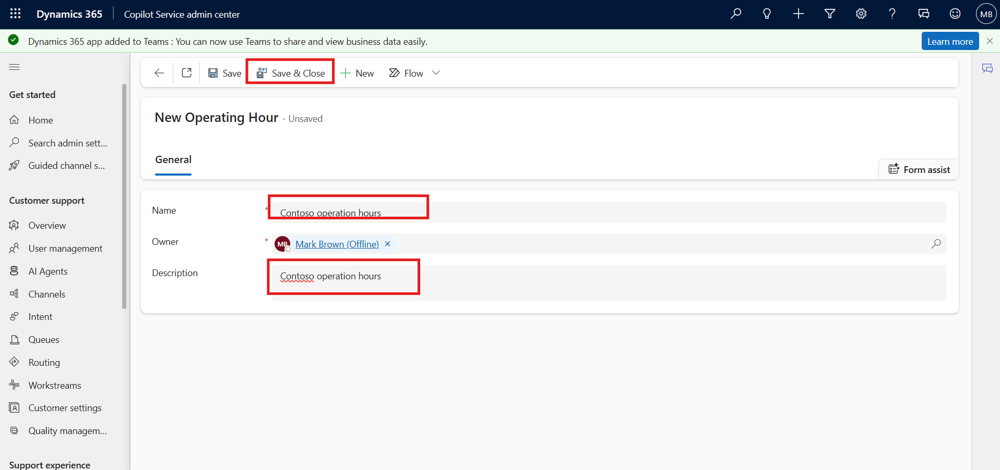

    > **Note:** If pop-up windows appear, click on **Continue anyway**.

12. On the **Contoso queue for supervisors** page, click **+** **Set
    operation hours** again.

13. On the **Set operation hours** pane, search for and select !!**Contoso
    operation hours**!! and click **Save and close.**

    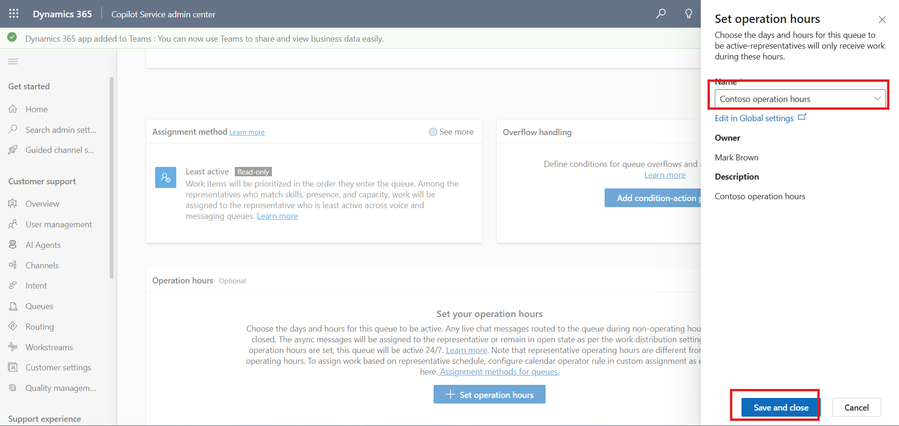

14. The operation hours record that you selected is configured for the
    queue.

    

### Task 2 - Copy an Existing Queue

1.  Navigate to queue, Select Advanced Queues **Manage,** select
    **Contoso queue for supervisors** and then select **Copy** from top
    bar. Again, click on the **Copy** button.

    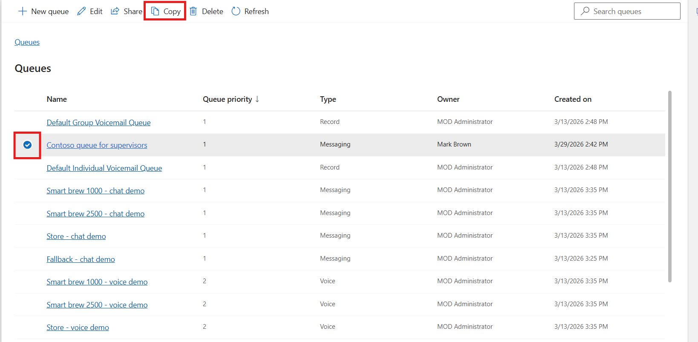

    

2.  The queue is copied and inherits the settings of the queue you
    copied from, including its name, prefixed with **Copy of Contoso
    queue for supervisors**.

    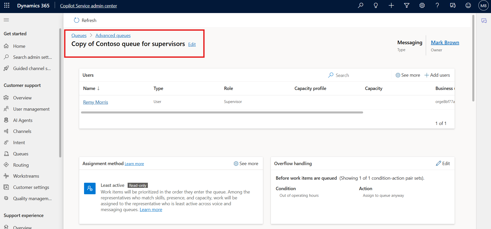

## Exercise 3: Configure Routing Rulesets

In this exercise, learners create routing rulesets that classify work
and direct it to the correct queue based on business conditions. They
define a work classification rule to set a service level and then build
a route-to-queue rule that sends eligible records to the supervisor
queue. This exercise demonstrates how routing logic can be used to
improve consistency, precision, and business-driven work distribution.

### Task 1 - Create a Work Classification Ruleset

1.  In the **Copilot Service admin center**, navigate to **Workstreams**
    under **Customer support** group and select **Contoso chat
    workstream**.

    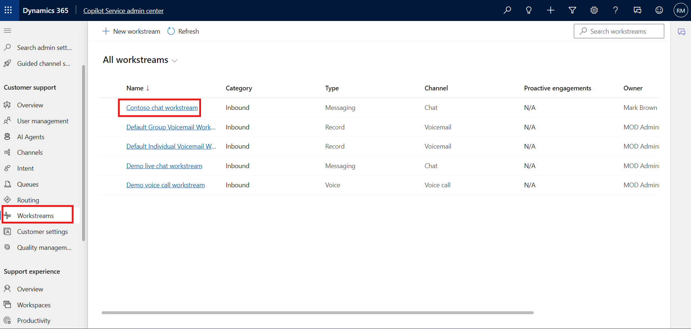

2.  On the **Contoso chat workstream** page, in the **Routing
    rules** area, select **+ Create ruleset** next to **Work
    classification (optional)** option.

    

3.  On the **Work classification** page, select **Create new.**

    

4.  In the **Create work classification ruleset** dialog, select
    **Logical rules** under **Rule type** and then enter the following
    details.

    - **Name –** !!Contoso ruleset!!

    - **Description –** !!Contoso ruleset!!

    - Click **Create**

    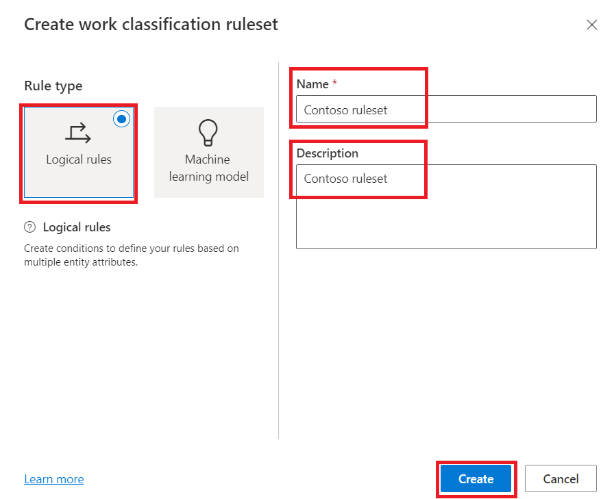

5.  In the **Decision list** area, select **+** **Create Rule.**

    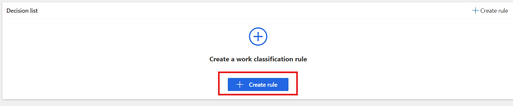

6.  On the **Create work classification rule** dialog, enter the
    following details in the **Conditions** area.

    - **Rule Name** - !!Set service level!!

    - Select **+ Add** and then select **Add related entity**.

    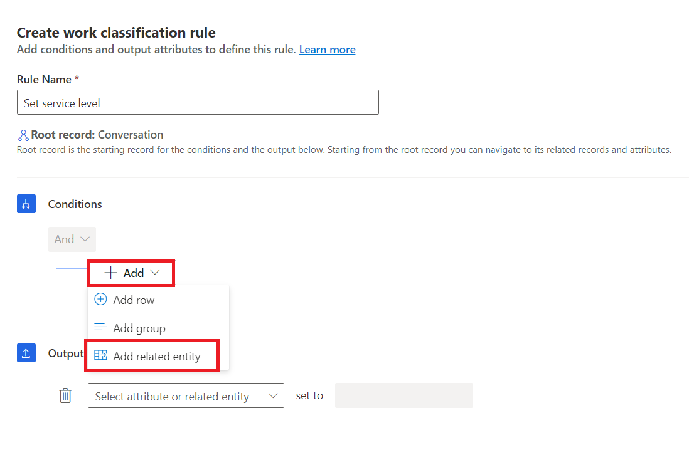

7.  Add **Issue (Case)** entity in the first block.

8.  Create the following condition: **Customer** **Equals** **Trey
    Research**

9.  In the **Output** area, enter the following: **Issue (Case), Service
    Level** set to **Gold.**

10. Click **Create**.

    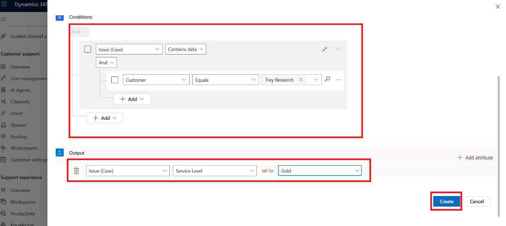

11. The **Set service level** rule is listed under **Decision list**.

    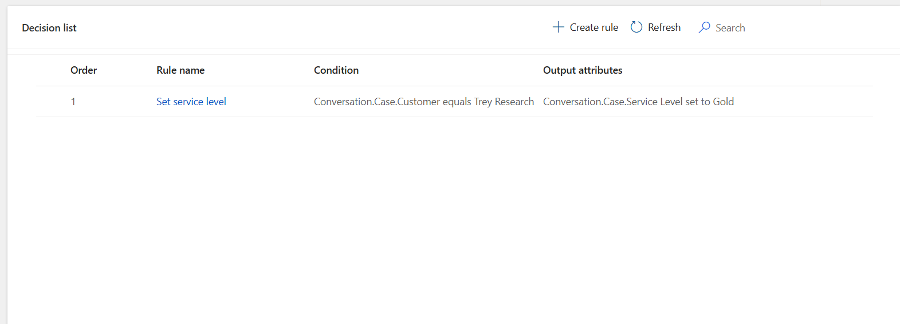

### Task 2: Create a Route-to-Queue Ruleset

1.  In the Dynamics 365 Copilot Service admin center, from the top
    select **Contoso chat workstream.**

    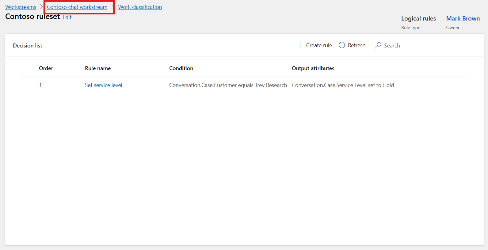

2.  In the **Routing rules** area, select **+** **Create ruleset** next
    to **Route to queues.**

    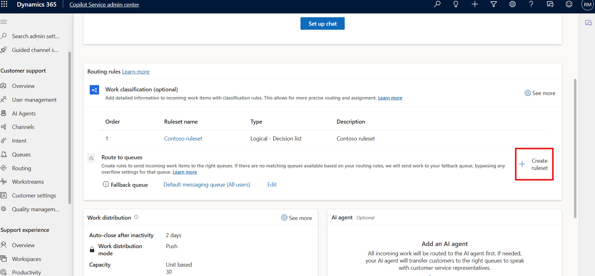

3.  On the **Create route-to-queues ruleset** pane, in the **Name**
    field enter !!**Based on Gold Level**!!. In the **Description**
    field enter !!**Rule based on Gold level**!!.

4.  Select **Create**.

    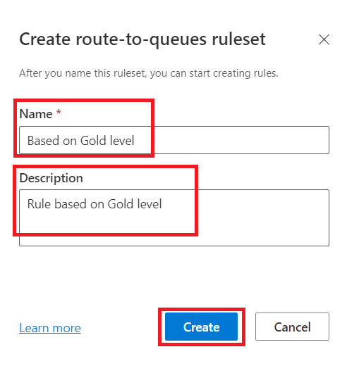

5.  In the **Decision list** area, select **+** **Create Rule.**

    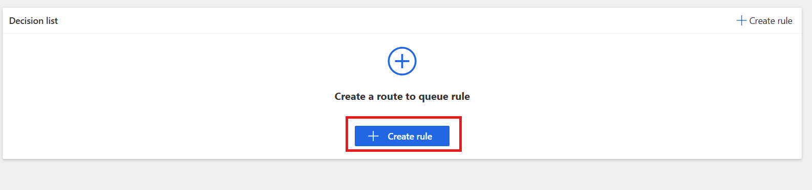

1.  On the **Create route to queue rule** dialog, enter the following
    details.

    - **Name** – !!**Based on Gold level**!!

    - Select **+ Add** and then select **Add related entity**.

    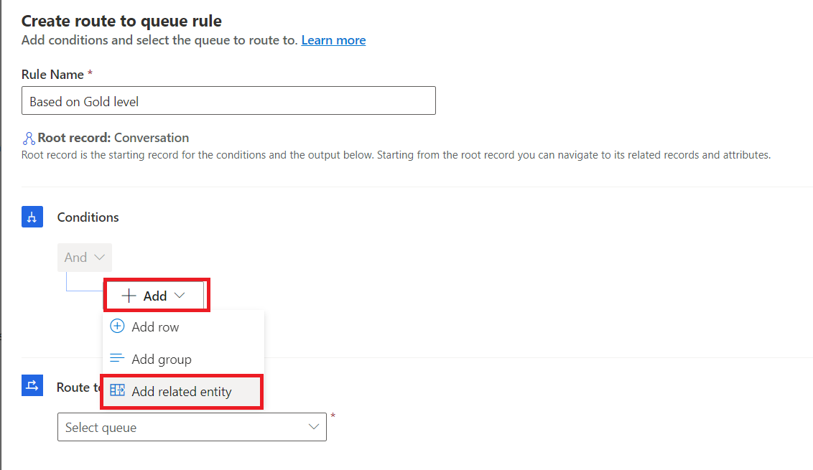

2.  Add **Issue (Case)** entity in the first block.

3.  Create the following condition: **Service level Equals Gold.**

4.  In the **Route to queues** area, select **Contoso queue for
    supervisors**.

5.  Click **Create**.

    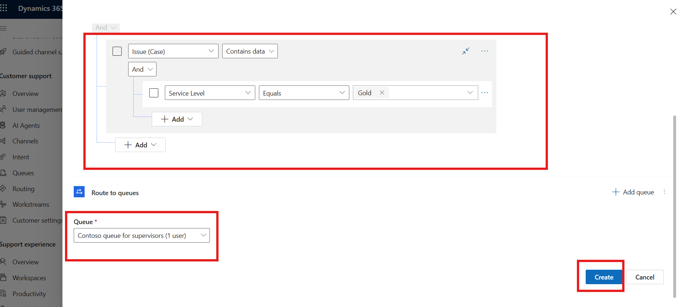

6.  The **Based on Gold level** rule is listed under **Decision list**.

    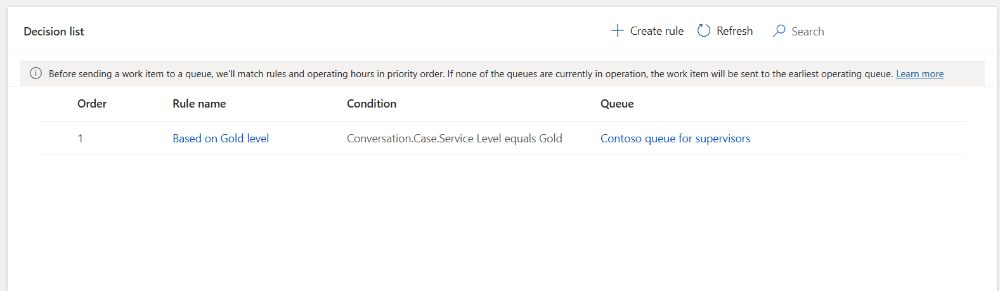

## Exercise 4: Configure Assignment and Prioritization Rules

In this exercise, learners configure the assignment framework used to
control how work is prioritized and distributed within a queue. They
create a work assignment record, define a prioritization ruleset for
high-priority cases, and build an assignment ruleset based on skills,
availability, and working hours. This exercise highlights how assignment
logic helps balance workloads and match work items to the most suitable
users.

1.  In the Copilot **Service admin center**, navigate to the site map
    and select **Queues** under **Customer support** group.

2.  On the **Queues** page, select **Manage** next to **Advanced
    queues**.

    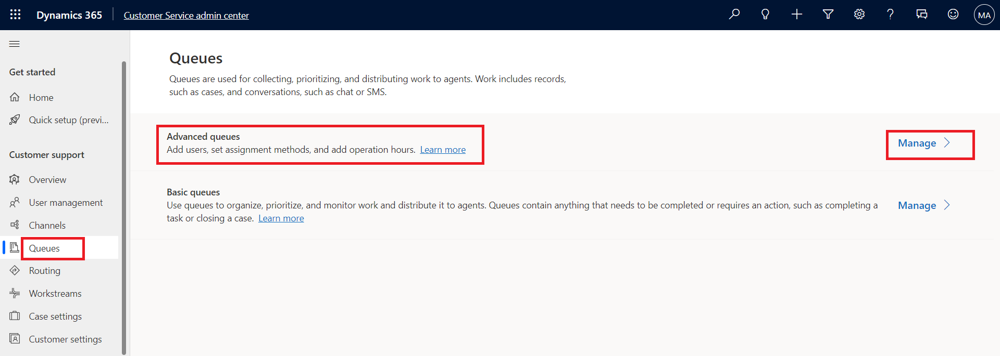

3.  Select **Contoso queue for supervisors**.
    
    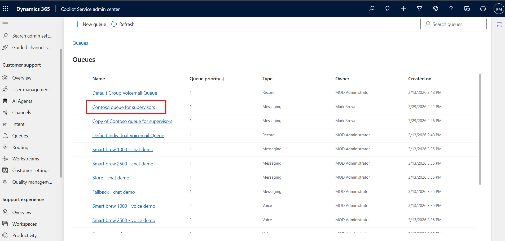

4.  On the **Contoso queue for supervisors**, click **See more** next to
    **Assignment method**.

    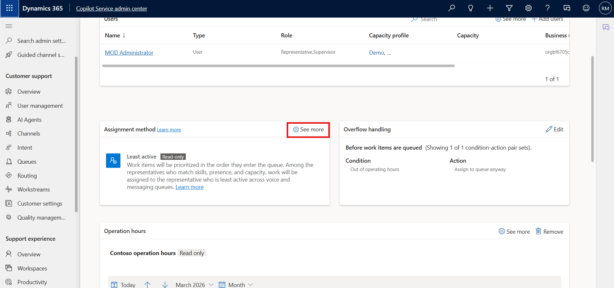

5.  On the **Assignment method** page, select **Highest Capacity** and
    then **Create New**.

    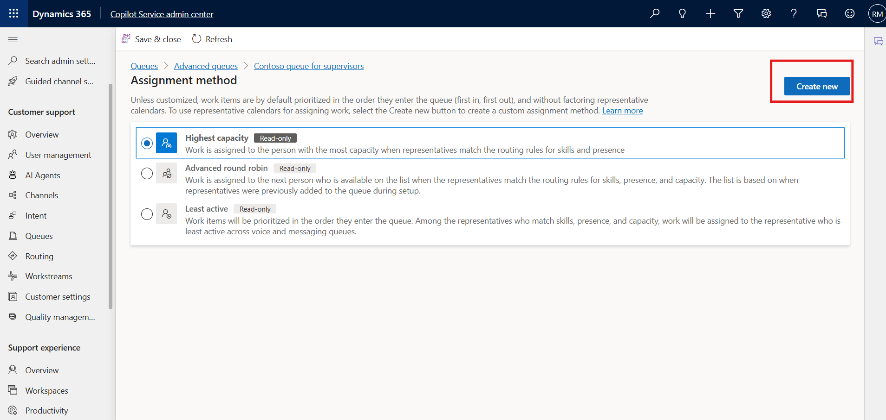

6.  In the **Create work assignment** dialog, enter !!Contoso work
    assignment!! in the **Name** field and **Description** field and
    then select **Create**.

    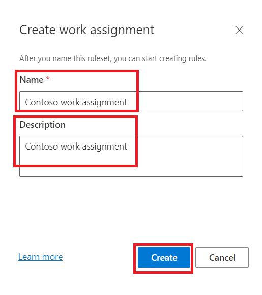

7.  On the **Prioritization Ruleset** area, click **+ Create ruleset**.

    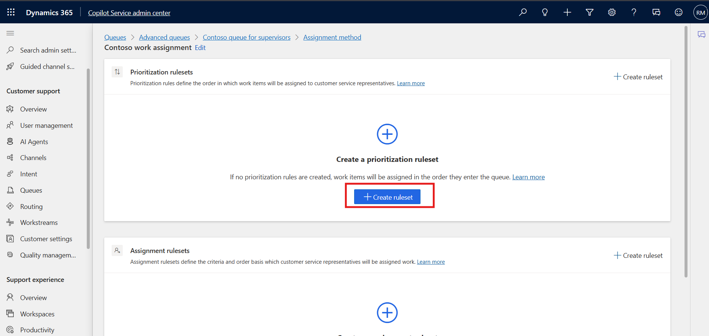

8.  On the **Create Prioritization Ruleset** dialog, enter !!Contoso
    prioritization ruleset!! in the **Name** field and **Description**
    field.

9.  Select **Create**.

    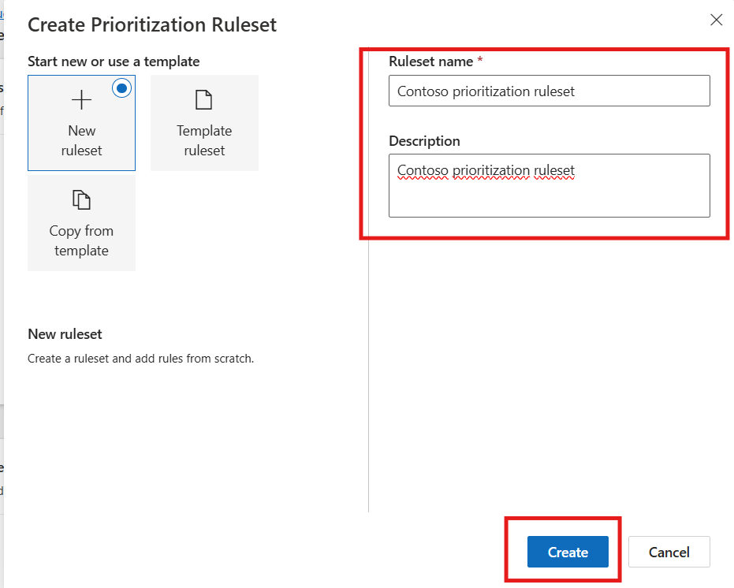

10. On the **Contoso prioritization ruleset** page, in the **Decision
    list** area, select **+** **Create rule.**

    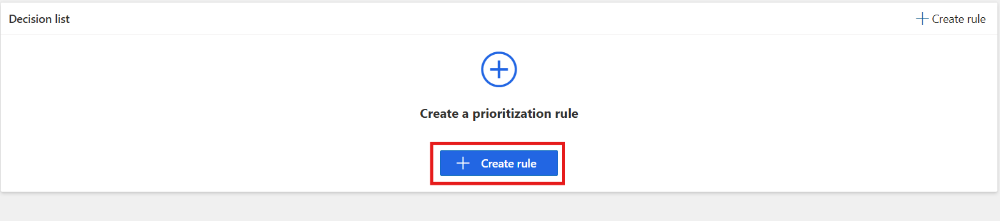

11. On the **Create Prioritization Rule Dialog**, enter !!Contoso
    prioritization rule!! in the **Name** field.

12. Select **+ Add** and then select **Add related entity**.

13. Add **Issue (Case)** entity in the first block.

14. Create the following condition: **Priority Equals High.**

15. In the **Order by** area, select **First in first out**.

16. Click **Create**.

    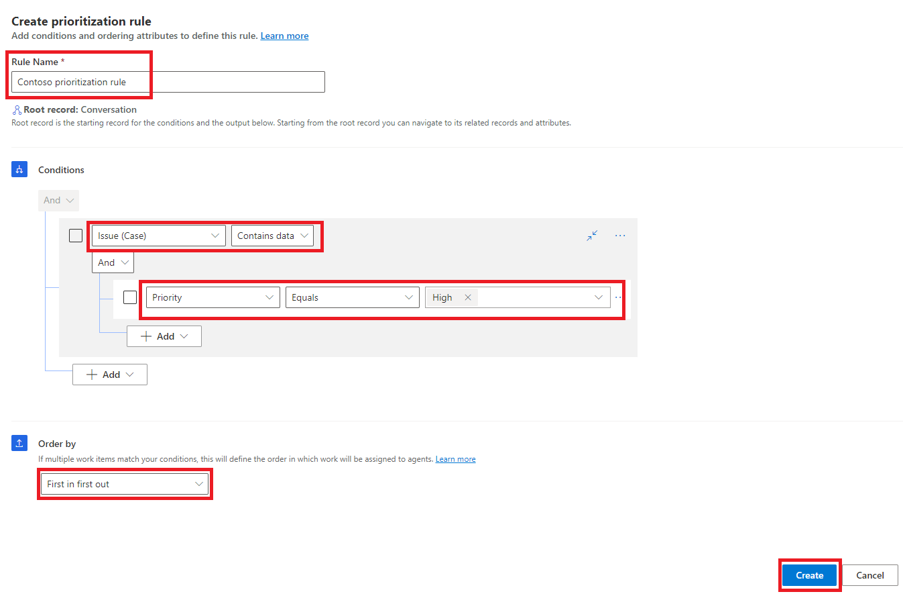

17. The **Contoso prioritization rule** is listed under **Decision
    list**.

    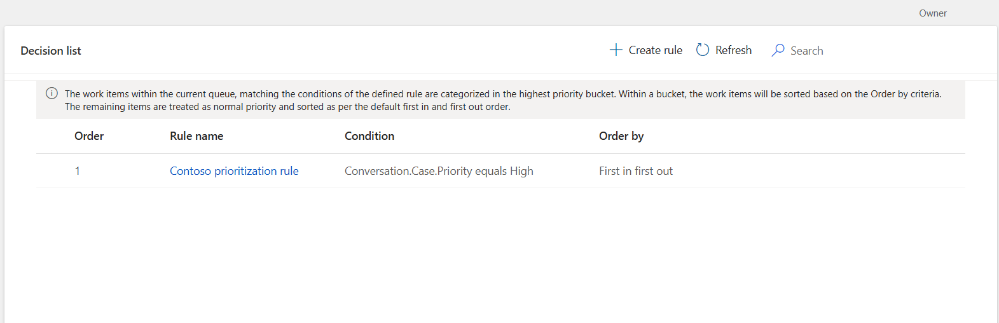

18. Click on the **Contoso work assignments** at the top to navigate
    back.

    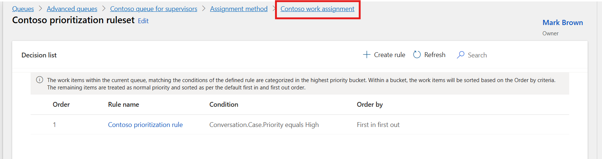

19. To create an assignment ruleset, click **+ Create ruleset** on the
    **Assignment rulesets** area.

    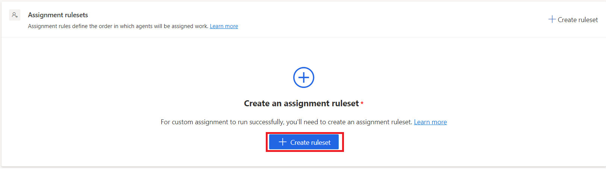

20. On the **Create Assignment Ruleset** dialog, enter !!Contoso
    assignment ruleset!! in the **Name** field and **Description**
    field.

21. Click **Create**.

    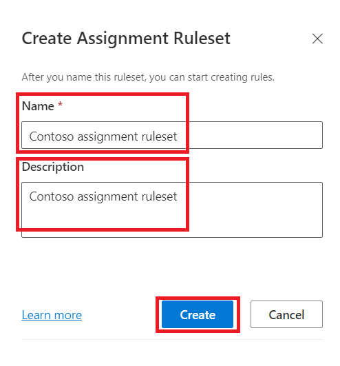

22. On the **Contoso assignment ruleset** page, in the **Decision
    list** area, select **+** **Create rule.**

    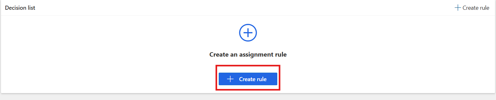

23. **On the Create Assignment rule** page, enter !!Contoso assignment
    rule!! in the **Name** field.

    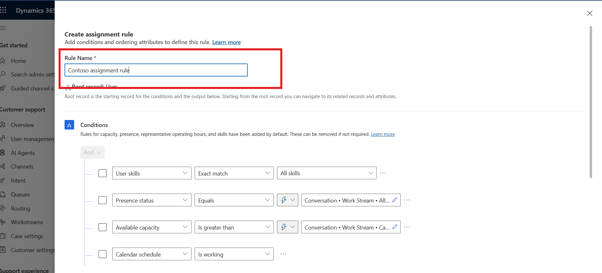

24. Click on the ellipsis icon on each condition rule and **delete** the
    rules that are already added.

    

25. Select **+ Add** and then select **Add row**.

    

26. Create the following condition in the first row: **User skills,
    Exact match, Skill.**

    

27. Select **+ Add** and then select **Add group**.

    

28. Create the following condition in the group: **Presence status,
    Equals, Available, Busy.**

    

29. Select **+ Add** in the group and then select **Add row**.

    

30. Create the following condition in the new row: **Calendar scheduleIs
    working.**
    
    

31. In the **Order by** area, select **Unit-based available capacity**.

32. Click **Create**.

    

33. The **Contoso assignment rule** is listed under **Decision list**.

    

## Exercise 5: Configure Skills and Skill-Based Routing

In this exercise, learners create a skill, define a rating model,
prepare the Omnichannel user profile for an agent, and assign the skill
with a rating value. The exercise demonstrates how skill-based routing
can be configured so that work is matched more effectively with agents
who have the required expertise. This helps improve routing quality and
supports more accurate service delivery.

### Task 1: Create a New Skill

1.  In the **Copilot Service admin center** navigate to the site map and
    select **User management** under the **Customer support** group.

2.  On the **User management** page, select **Manage** next to
    **Skills**.

    

3.  Select **+ New** to create new skill.

    

4.  Specify the following in the **New Characteristic** page.

    **Name** - !!Spanish!!

    **Type** - Skill

    **Description** - !!This record is used to define the skill level of
    the Spanish language!!

5.  Select **Save & Close** from top bar.

    

### Task 2: Configure Skill-Based Routing and Rating Model

1.  In the **Copilot Service admin center** navigate to the site map and
    select **Routing** under the **Customer support** group.

2.  Select **Manage** next to the **Skill-based routing**.

    

3.  On the **Omnichannel Configuration** page, set the toggle for
    **Enable update skill control** to **Yes**. In the **Rating
    Model** section, select **+ New Rating Model**.

    

4.  Specify the following in the **New Rating Model** page.

    **Name** - !!Language rating model!!

    **Min Rating Value** - !!1!!

    **Max Rating Value** - !!10!!

5.  Select **Save**.

    

6.  The **Rating Values** section appears. Click on the vertical
    ellipsis and select **+** **New Rating Value**.

    

7.  The **New Rating Value** page appears.

8.  Specify the following.

    **Name** - !!Language rating value!!

    **Value** - !!10!!

9.  Select **Save & Close** to save and add the rating value to the
    grid.

    

10. Select **Save & Close** on the top of the language rating model page
    to navigate back to the Omnichannel Configuration page.

    

11. On the **Omnichannel Configuration** page, click **Save & Close**

    

### Task 3: Configure an Omnichannel User Profile

1.  In **Dynamics 365 Copilot Service admin center**, in the site map,
    select **User management** under the **Customer support** group.

2.  On the **User management** page, select **Manage** next
    to **Users**.

    

3.  Click the dropdown next to **Enabled Users** and select
    **Omnichannel Users**.

    

4.  On the **Omnichannel Users** page, select **David Flores** from the
    list.

    

5.  Select the **Omnichannel** tab.

    

6.  Select **+ New Bookable Resource** under the **Skills
    Configuration** section.

    

7.  Select **David Flores** as the user in the field and click on the
    Save button.

    

8.  Click the **Work Hours** tab to see the details of David **Flores**.

    

9.  Select the **General** tab and then select **Save & Close** to
    navigate back to your admin User page.

    

10. Again, select **Save & Close**.

    

### Task 4: Assign Skill and Rating Value to an Agent

1.  In the **Copilot Service admin center** navigate to the site map and
    select **User management** under the **Customer support** group.

2.  On the **User management** page, select **Manage** next
    to **Skills**.

    

3.  Select the skill “**Spanish**” from the list for which you want to
    assign the agents.

    

4.  Select **+ New Bookable Resource Characteristic** in the **Users
    (Agents)** section.

    

5.  On the **New Bookable Resource Characteristic** page, click on the
    rating value field, press enter button and select **Language rating
    value** for the **Rating Value** field and select **David Flores**
    for the **Resource** field.

6.  Select **Save and Close**.

    

7.  On the **Spanish** Characteristic page, select **Save and Close**.

    

## Conclusion

In this lab guide, learners configured the core components that control
how customer work is received, organized, routed, prioritized, and
assigned in Dynamics 365 Contact Center. They created workstreams and
queues, defined routing rules and assignment logic, and enabled
skill-based routing to align work with agent capability. Together, these
configurations establish a stronger operational foundation for
structured support delivery, more accurate routing decisions, and
improved workload management across the Contact Center environment.
