# Lab 4 - Configure Workforce Management and shift-based routing in Dynamics 365 Contact Center

**Duration: 30 mins**

**Introduction**

This lab guide focuses on enabling workforce management capabilities in
Dynamics 365 Contact Center and activating shift-based routing for work
distribution. In this lab, Mark Brown performs the required
configuration tasks by using his System Administrator and Omnichannel
Administrator roles. The exercises guide learners through installing the
Workforce Management for Customer Service app in the Power Platform
admin center and then enabling shift-based routing in the Copilot
Service admin center. By completing this lab, learners gain practical
experience in extending the Contact Center environment with workforce
management features that support scheduling-aware routing and more
efficient work assignment.

## Exercise 1 - Install Workforce Management for Customer Service App

In this exercise, you will access the Power Platform admin center and
install the Workforce Management for Customer Service app in the
ContactCenter service trial environment. This app adds workforce
planning and shift-based management capabilities that support more
structured customer service operations.

1.  Navigate to the Power Platform admin center:
    !!<https://admin.powerplatform.microsoft.com/>!!.

2.  Sign in by using **Mark Brown's** credentials. Mark Brown is
    assigned the **System Administrator** and **Omnichannel
    Administrator** roles.

    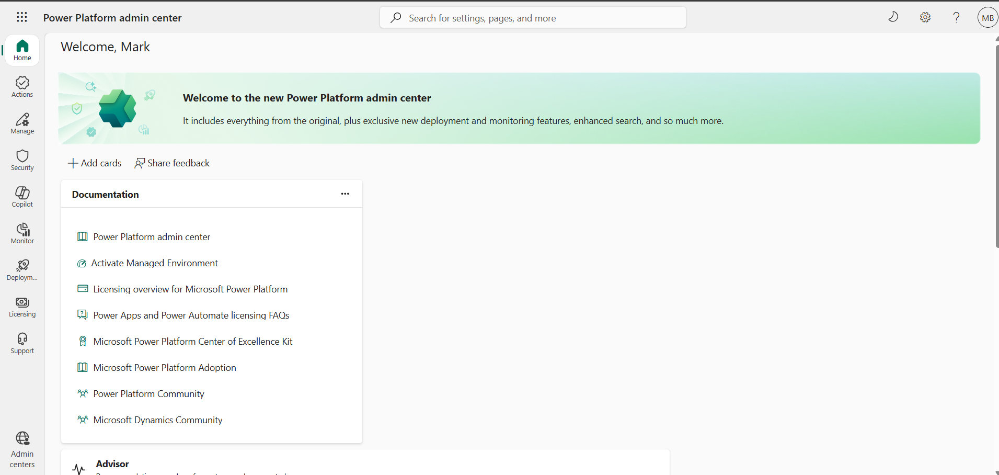

3.  From the left navigation pane, select **Manage**.

4.  Select **Environments**.

5.  Open the **ContactCenter service trial** environment.

    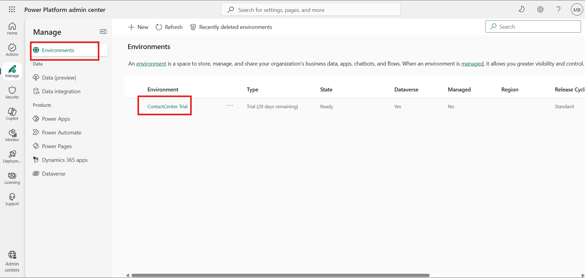

6.  On the command bar, select **Resources** \> **Dynamics 365 apps**.

    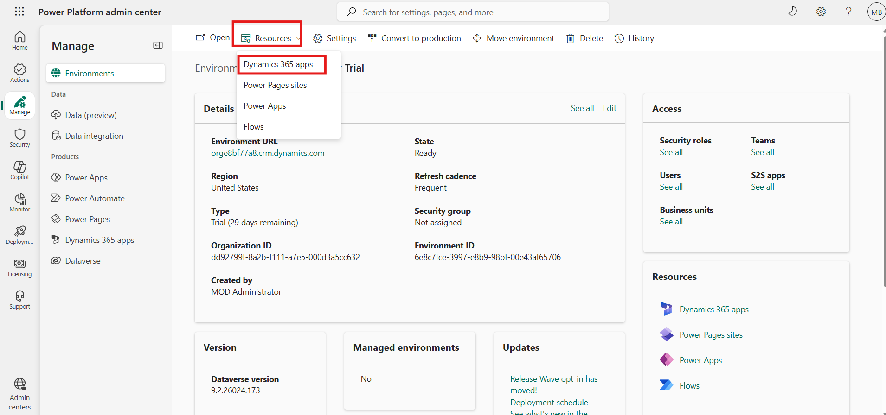

7.  On the **Dynamics 365 apps** page, select **Install app**.

    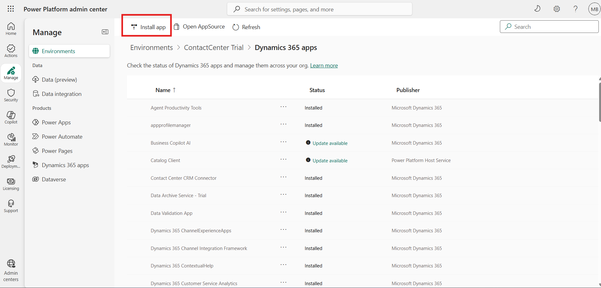

8.  From the available apps list, select **Workforce Management for
    Customer Service**.

9.  Select **Next** to continue.

    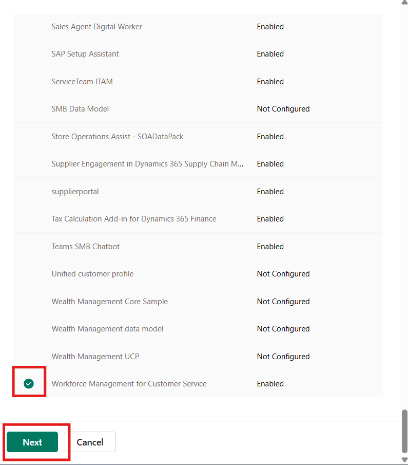

10. Select the **Agree to the terms of service** checkbox.

11. Select **Install**.

    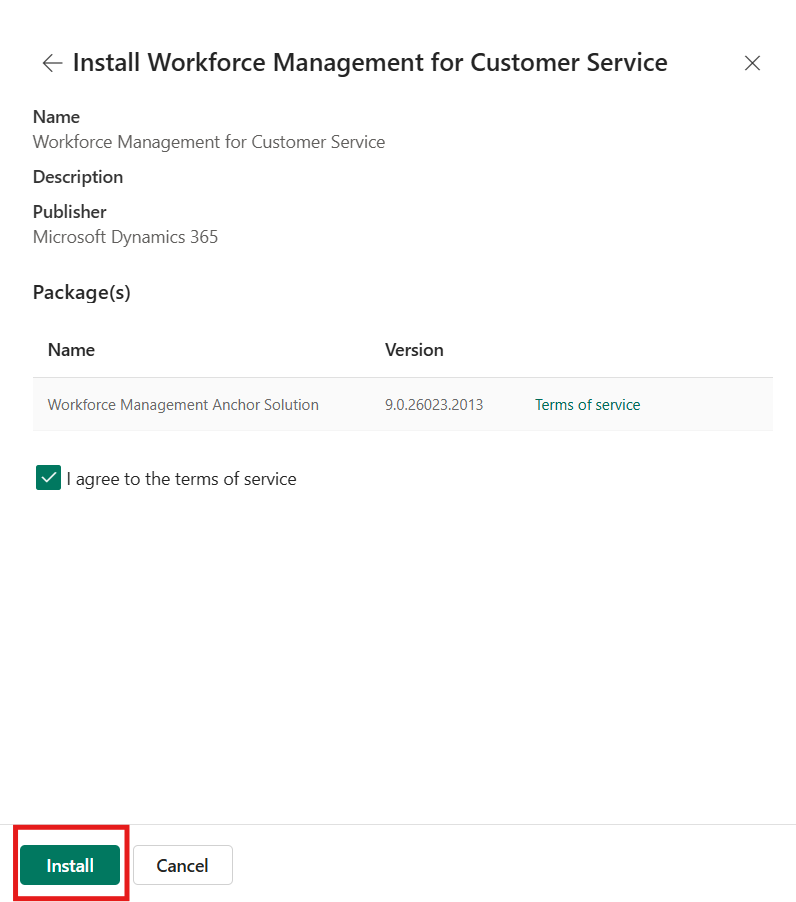

12. Wait for the installation to complete on the **Dynamics 365 apps**
    page.

**Note:** The installation may take approximately 15 minutes to
complete.

    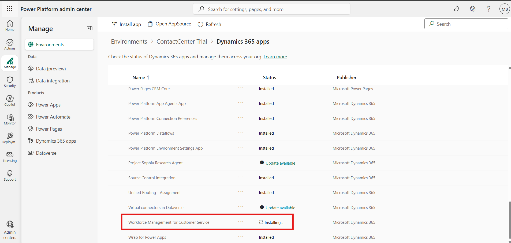

13. Verify that **Workforce Management for Customer Service** is
    installed successfully.

    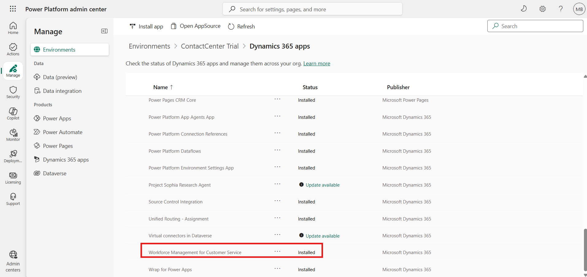

## Exercise 2 - Enable Shift-Based Routing

In this exercise, you will sign in to the Contact Center environment and
enable the shift-based routing feature in the Copilot Service admin
center. This feature allows work items to be routed based on shift
bookings so that customer work is assigned to agents who are scheduled
and available during the appropriate time.

1.  Log in to the Contact Center environment by using **Mark Brown's**
    credentials. Mark Brown is assigned the **System Administrator** and
    **Omnichannel Administrator** roles.

2.  From the Application selector, select **Copilot Service admin
    center**. Refresh the portal to ensure the newly installed app
    components are available.

    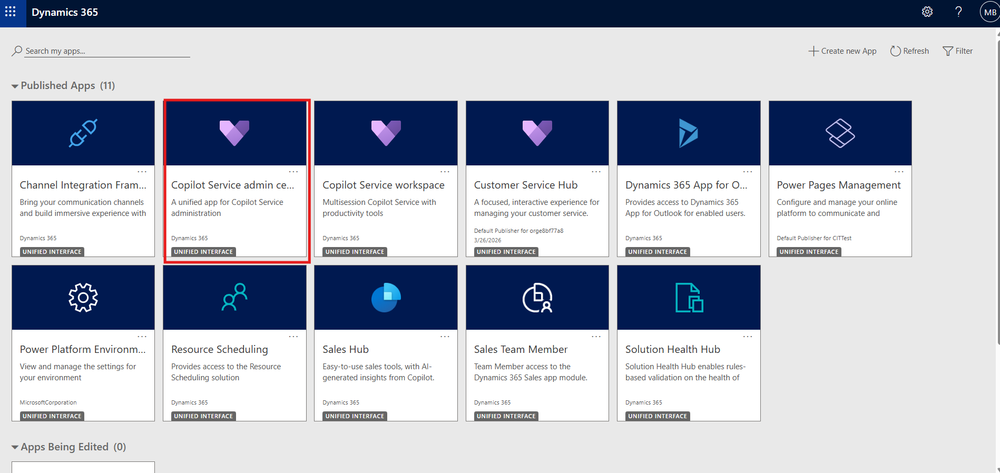

3.  In the site map, under **Operations**, select **Workforce
    management**.

    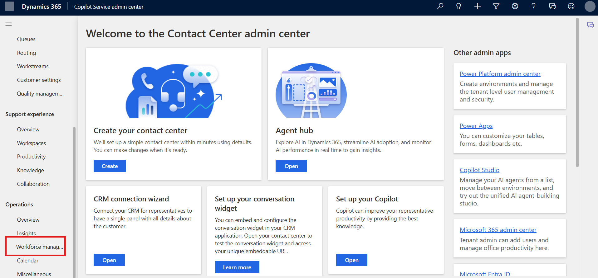

4.  In the **Shift-based routing (preview)** section, select **Manage**.

    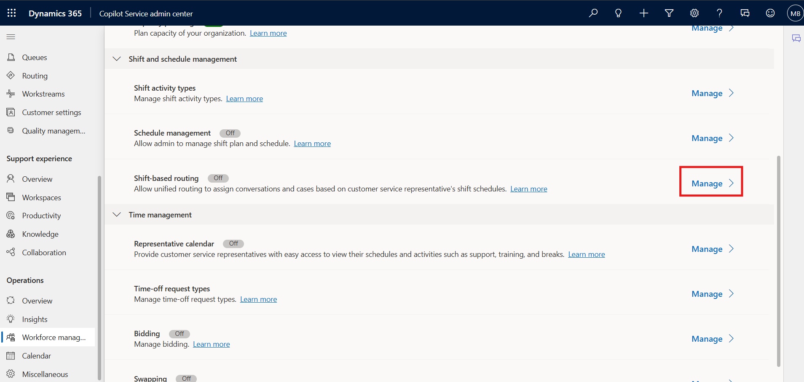

5.  On the **Shift-based routing** page, turn on the **Enable routing
    based on shift bookings** toggle.

6.  Select **Save and Close**.

    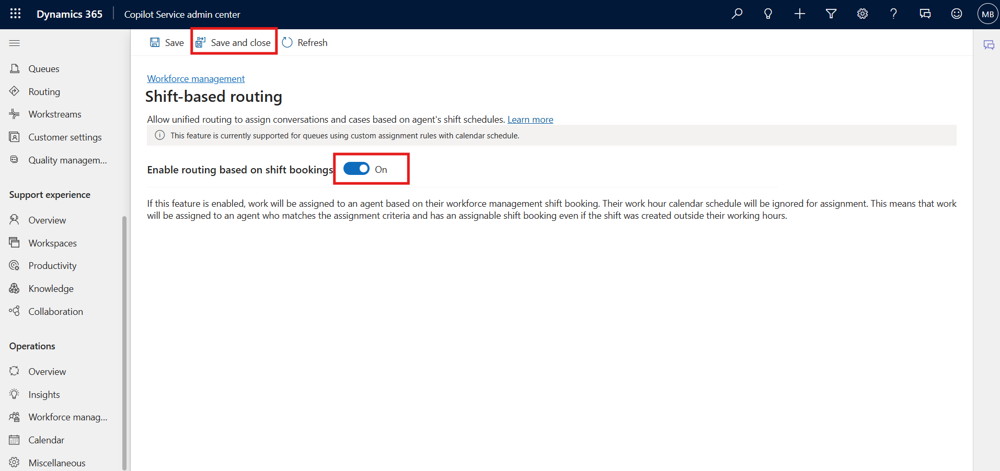

7.  Verify that the shift-based routing feature is enabled successfully.

    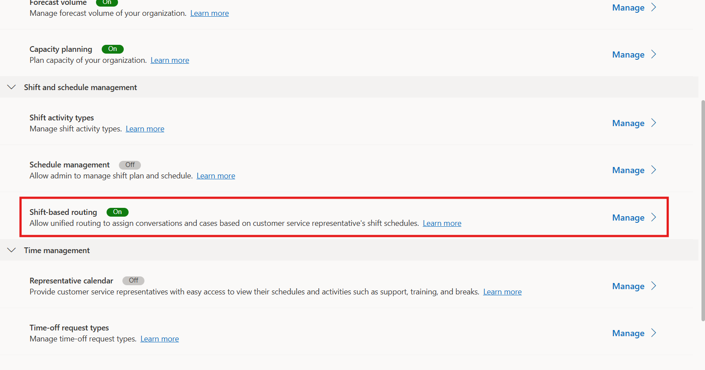

## Conclusion

In this lab guide, you installed the Workforce Management for Customer
Service app and enabled shift-based routing in Dynamics 365 Contact
Center. These configurations extend the Contact Center environment with
workforce-aware capabilities that support shift-based availability and
more accurate work distribution. Together, they provide the foundation
for aligning routing behavior with workforce planning and scheduling
requirements.
