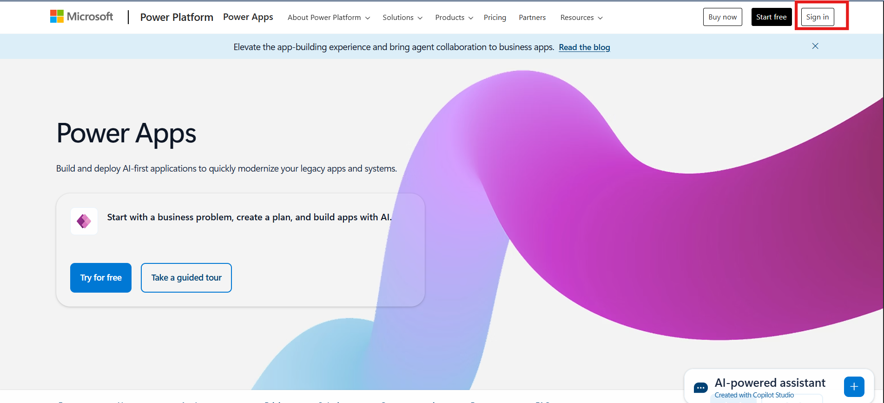
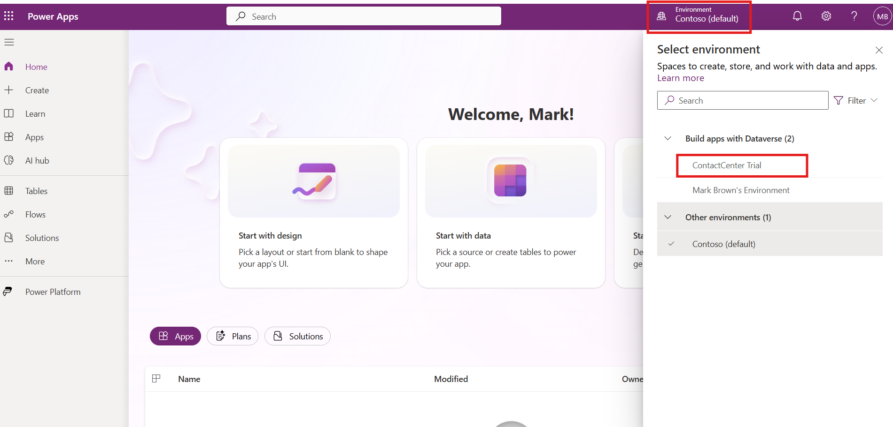
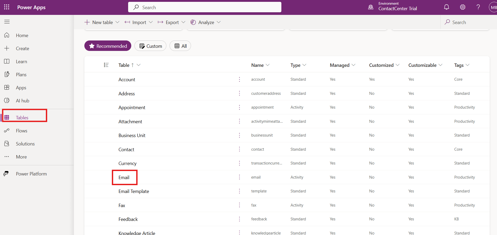
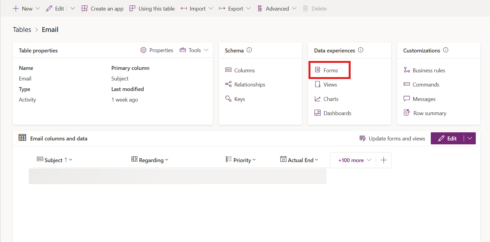
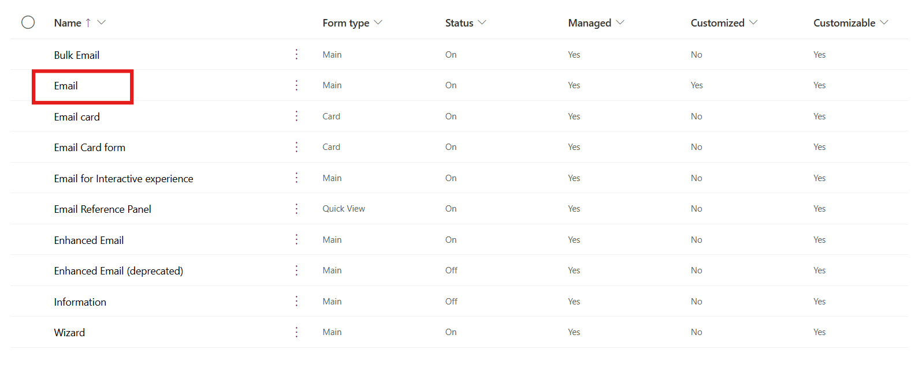
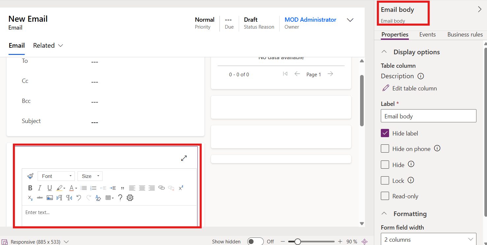
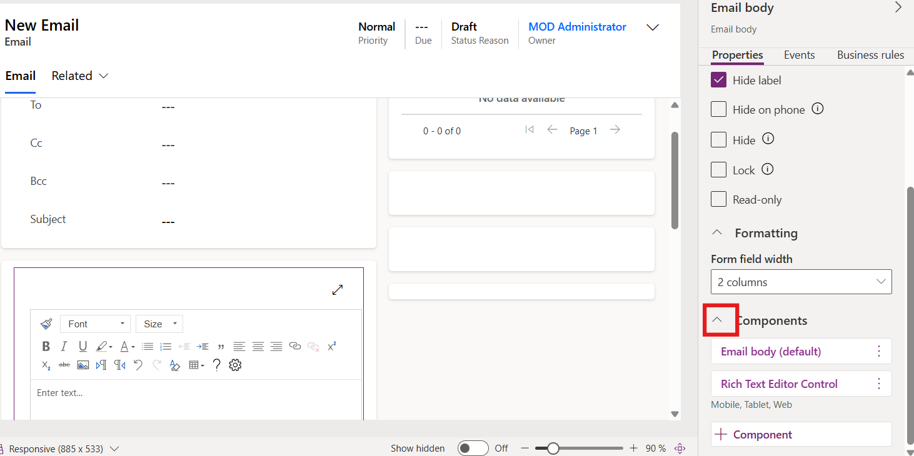
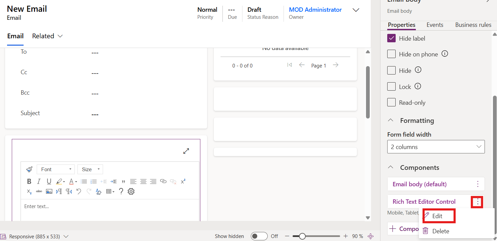
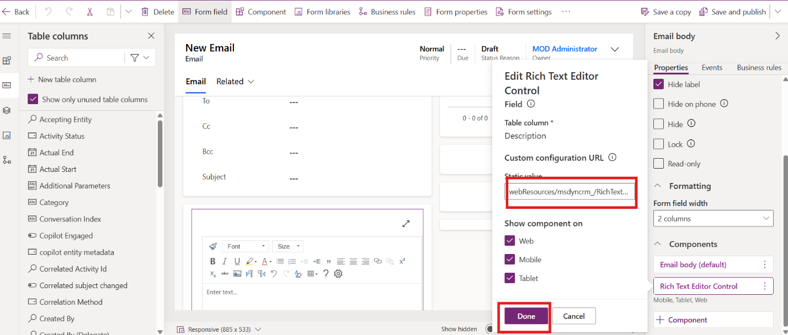
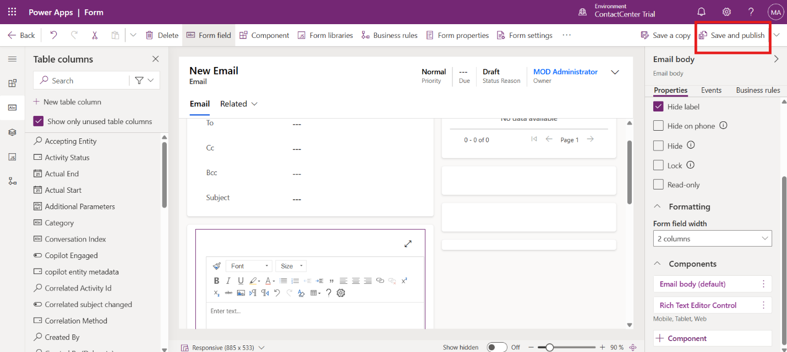

# Lab 8 - Add a Knowledge article rich text editor control to the Email form

**Introduction**

This lab guide focuses on updating the Email form in Power Apps by
configuring the Rich Text Editor control to use a Knowledge
article-specific configuration file. In this lab, Mark Brown performs
the required customization steps in the ContactCenter Trial environment.
By completing this lab, learners gain practical experience in modifying
form components and applying a Rich Text Editor control configuration
that supports Knowledge article-related authoring and content handling
in the email experience.

## Exercise 1 - Add a Knowledge article Rich Text Editor control to the Email form

1.  Open a tab in the browser, paste the Power Apps URL –
    !!https://make.powerapps.com!!. Click on the Sign In button. Login
    with Mark Brown credentials.

    

2.  Change the environment to **ContactCenter** **Trial** on the top
    right corner of the power platform home page.

    

3.  Select **Tables** on the left navigation pane. Select **Email**
    table.

    

4.  Select Forms under **Data experiences**.

    

5.  Select **Email**.

    

6.  Double click on the Email body to open the properties on the
    right-hand side.

    

7.  Expand **components** by scrolling down.

    

8.  For **Rich Text Editor Control** component, select the three
    vertical dots and then select **Edit**.

    

9.  Paste the below text under static value -
    !!**webResources/msdyncrm\_/RichTextEditorControl/KnowledgeArticleRTEconfig.js**!!

10. Select **Done**, and then select **Save and Publish**.

    

  

**Conclusion**

In this lab guide, you updated the Email form in Power Apps by
configuring the Rich Text Editor Control to use a Knowledge
article-specific configuration file. This change helps extend the form
experience with a richer editing setup that supports Knowledge-related
content scenarios. Together, these steps demonstrate how administrators
can customize form components in the ContactCenter Trial environment to
better align with content and authoring requirements.
