# Lab 9 - Build collaborative workflows using Microsoft Teams Chat and AI-based suggestions in Dynamics 365 Contact 

**Introduction**

This lab guide focuses on configuring Microsoft Teams Chat collaboration
features and suggested contact capabilities in Dynamics 365 Contact
Center. In this lab, you will enable Microsoft Teams Chat integration,
configure chat connections for record types, manage chat disconnection
and join settings, and enable both AI-based and rules-based suggested
contacts. By completing this lab, learners gain practical experience in
building collaborative workflows that connect Dynamics 365 records with
Microsoft Teams conversations and intelligent contact suggestions.

# Exercise 1 - Configure Microsoft Teams Chat integration

In this exercise, you will enable Microsoft Teams Chat in the Copilot
Service admin center and configure how chats connect to Dynamics 365
records. You will also add additional record types, manage chat
disconnection behavior, and configure the join chat setting. This
exercise establishes the collaboration foundation required for Microsoft
Teams-based communication in the Contact Center environment.

## Task 1 - Enable Microsoft Teams Chat and integration

1.  Log in to the Contact Center environment by using **Admin Tenant**
    credentials. Admin tenant is assigned the required Global
    administrative role to perform this exercise.

    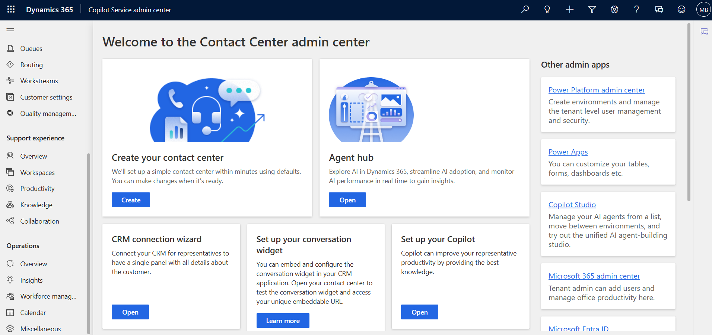

2.  In the **Copilot Service admin center**, go to **Support
    experience** and select **Collaboration**.

3.  In **Embedded chat using Teams**, select **Manage**.

    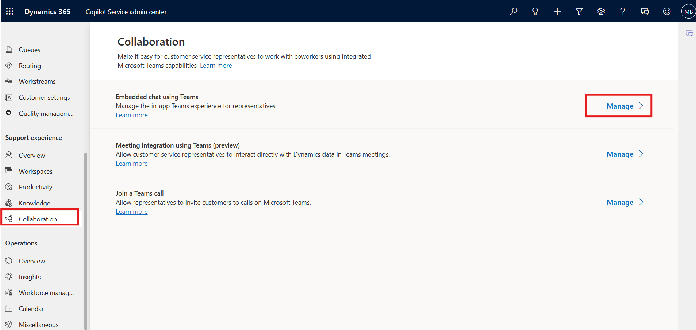

4.  On the **Microsoft Teams collaboration and chat** page, turn on the
    toggle for **Turn on Microsoft Teams chats inside Dynamics 365** and
    select **Turn on for all Dynamics 365 apps**.

    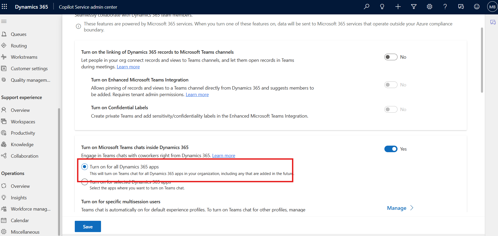

5.  Next, set the toggle for **Turn on the linking of Dynamics 365
    records to Microsoft Teams channels** to **Yes**. This setting
    requires tenant admin permission.

    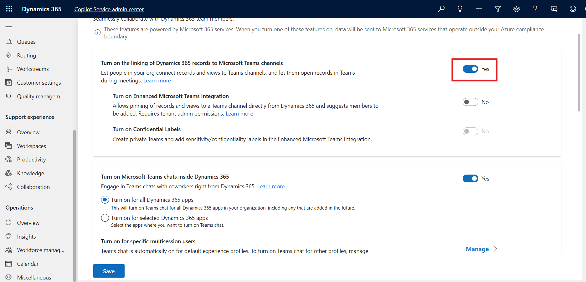

6.  Next, set the toggle for **Turn on Enhanced Microsoft Teams
    Integration** to **Yes**. This setting requires tenant admin
    permission.

7.  Sign in (if prompted) and then accept the consent.

    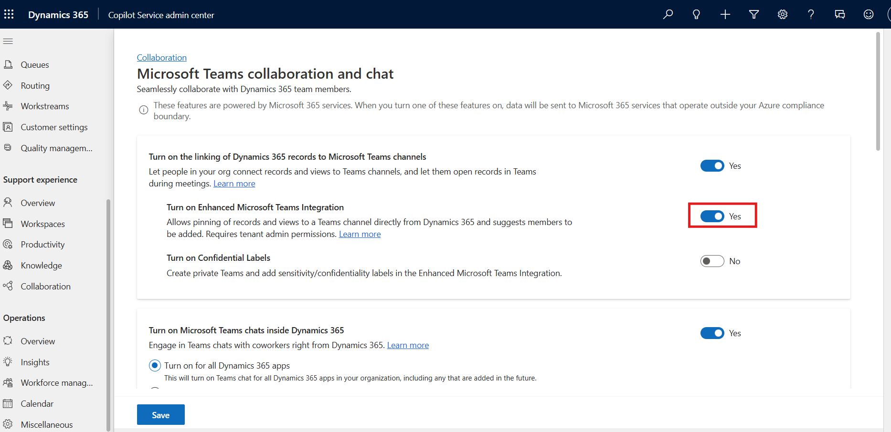

8.  Next, set the toggle for **Turn on Confidential Labels** to **Yes**.
    This setting requires tenant admin permission.

9.  Sign in (if prompted) and then accept the consent.

    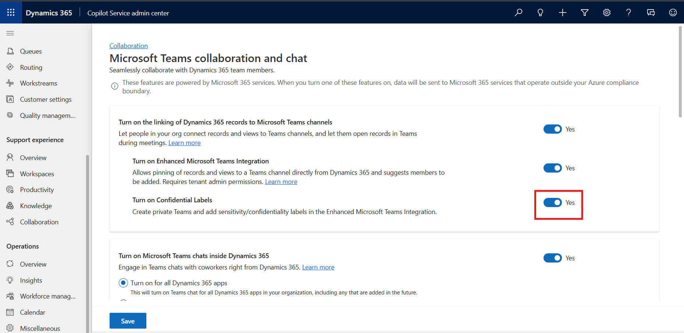

10. From the bottom-left corner, click **Save**.

    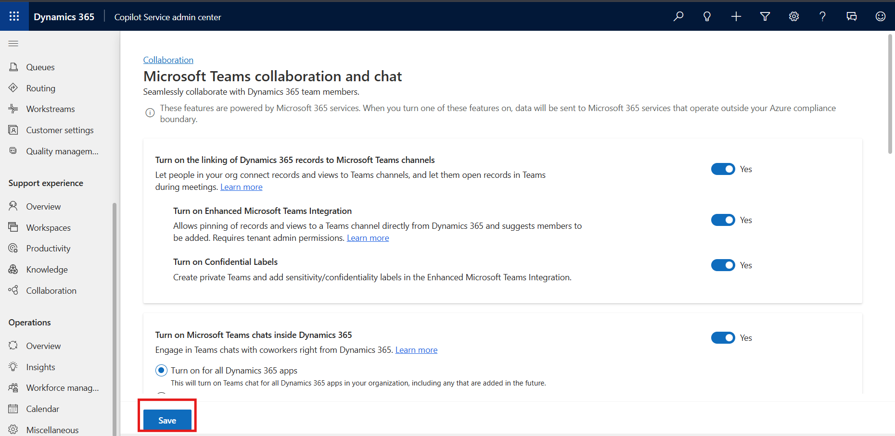

## Task 2 - Configure chat connections for record types

1.  In the **Copilot Service admin center** or **Contact Center admin
    center**, go to **Support experience**, and select
    **Collaboration**.

2.  In **Embedded chat using Teams**, select **Manage**.

    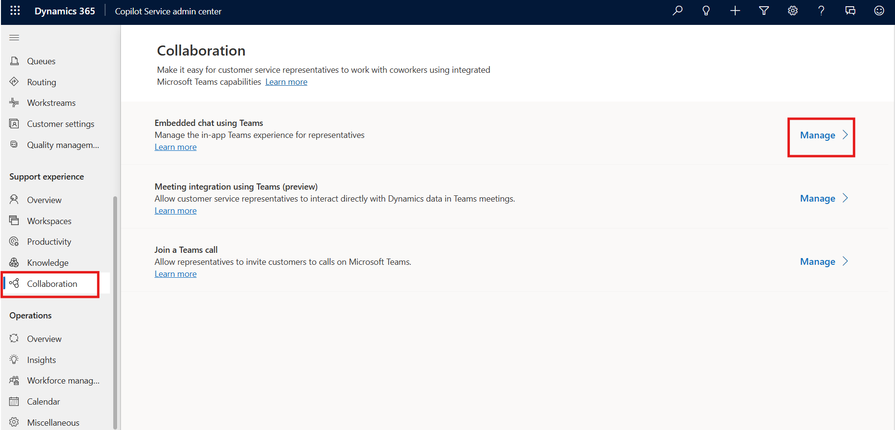

3.  Under **Connect chats to Dynamics 365 records**, select the record
    type you want to configure. For example, select **Case** record.

    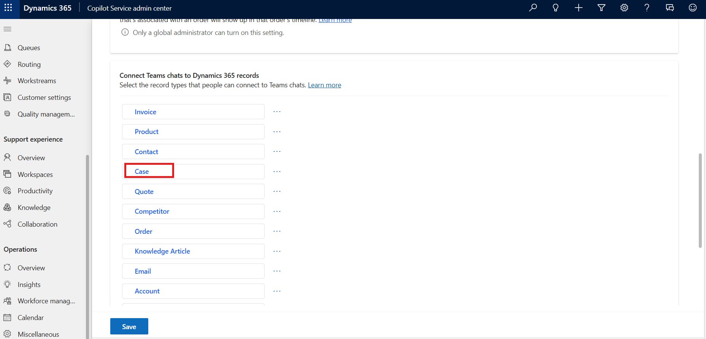

4.  Click on the **Message view** field and select **All case**, then
    click **Save**.

    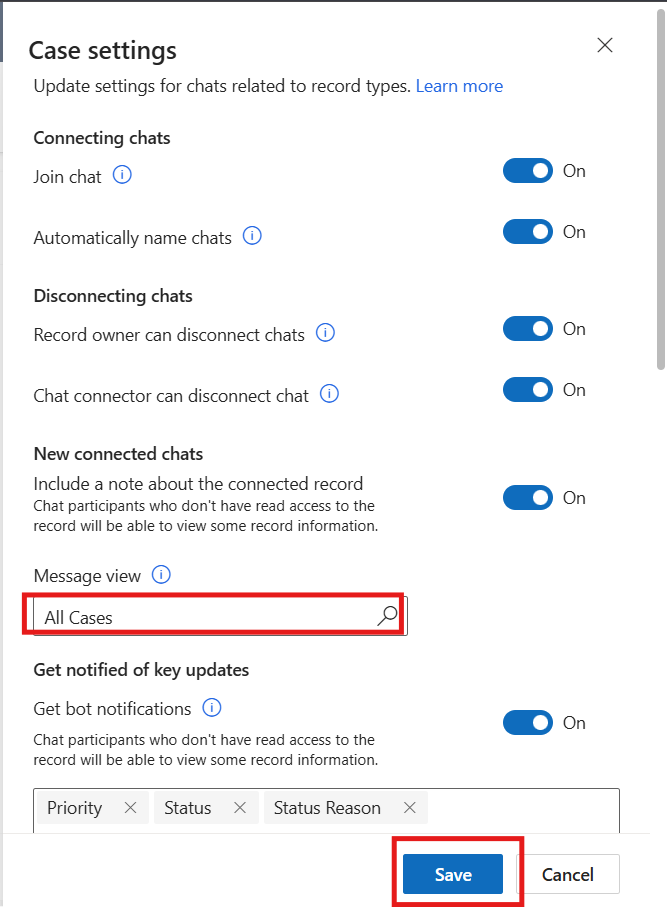

## Task 3 - Add additional record types for chat connections

1.  Under **Connect chats to Dynamics 365 records**, select **Add record
    types**.

    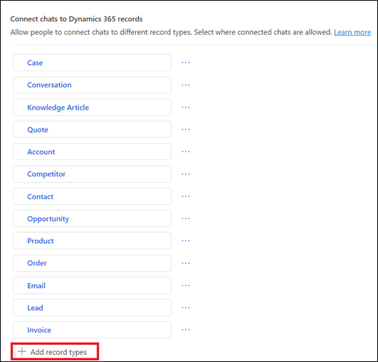

2.  On the **Allow chats to be connected to this record type** page, in
    **Choose record type**, select the name of the record type you want
    to use. For example, select **Available Times**.

3.  Select **Save**.

    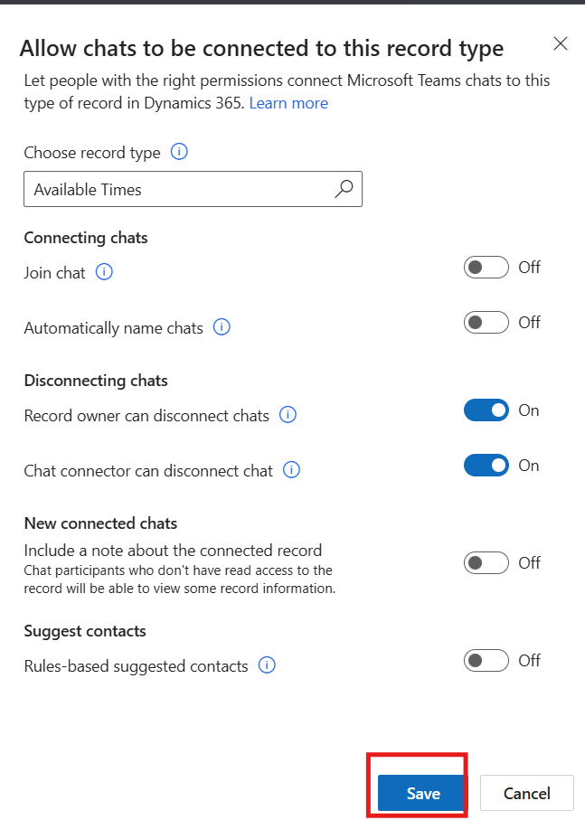

## Task 4 - Configure chat disconnection settings

1.  In the **Copilot Service admin center** or **Contact Center admin
    center**, go to **Support experience**, and select
    **Collaboration**.

2.  In **Embedded chat using Teams**, select **Manage**.

3.  Under **Connect chats with Dynamics 365 records**, select the record
    type you want to configure, for example, **Case**.

    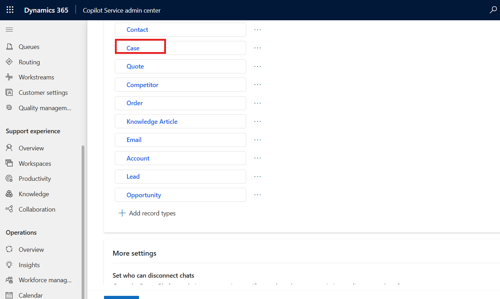

4.  On the **Case settings** pane, in **Disconnecting chats**, toggle
    off **Chat connector can disconnect chats** and then click **Save**.

    

## Task 5 - Toggle join chat setting

1.  In the **Copilot Service admin center** or **Contact Center admin
    center**, go to **Support experience**, and select
    **Collaboration**.

2.  In **Embedded chat using Teams**, select **Manage**.

3.  On the **Microsoft Teams collaboration and chat** page, in **Connect
    chats to Dynamics 365 records**, select the specific record type,
    for example, **Case**.

    

4.  In the settings pane, toggle **Join chat** on or off.

5.  Click **Save**.

    

# Exercise 2 - Enable AI-based suggested contacts

In this exercise, you will enable AI-based suggested contacts for
supported record types in the collaboration settings. This feature helps
agents identify relevant contacts during support interactions by using
processed organizational data.

## Task 1 - Enable AI-based suggested contacts

1.  In the site map of **Copilot Service admin center**, go to **Support
    experience** \> **Collaboration**.

2.  In **Embedded chat using Teams**, select **Manage**.

    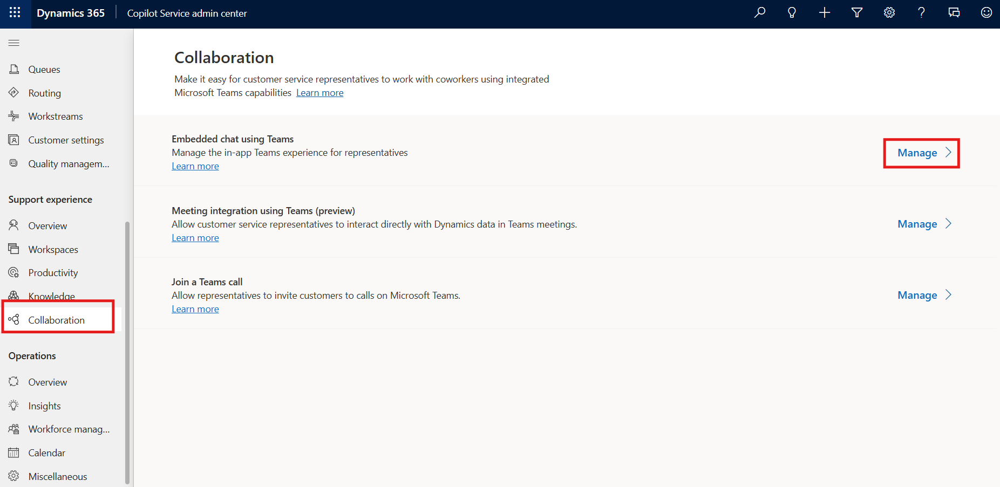

3.  To get suggested contacts for active cases or supported
    conversations, perform the following:

    1.  In **Connect chat to Dynamics 365 records**, select **Case**.
        The **Conversation settings** pane appears on the right.

    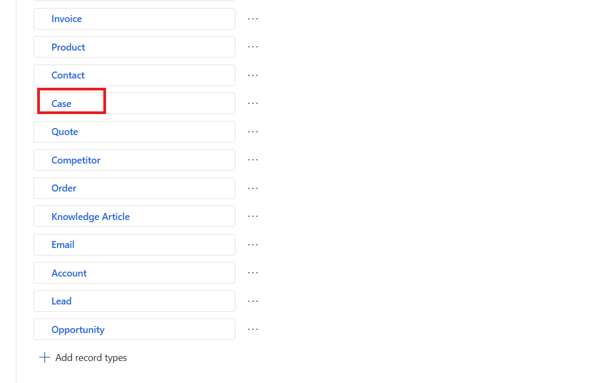

2.  In **Suggest contacts**, turn on the toggle for **AI-based suggested
    contacts** and then select **Save**.

3.  Select **Save** on the **Microsoft Teams collaboration and chat**
    page to reflect the changes.

    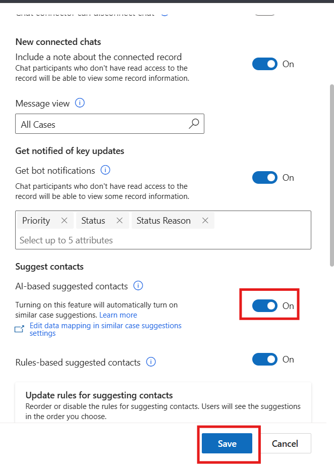

4.  Note that it takes **24 hours** for the data to be preprocessed for
    first-time use.

# Exercise 3 - Configure rules-based suggested contacts

In this exercise, you will enable rules-based suggested contacts for a
record type and manage the rules used to generate those suggestions. You
will also create a new relational rule to control how suggested contacts
are surfaced to users.

## Task 1 - Enable rules-based suggested contacts

1.  In the site map of the **Copilot Service admin center**, under
    **Support experience**, select **Collaboration**.

2.  In **Embedded chat using Teams**, select **Manage**.

    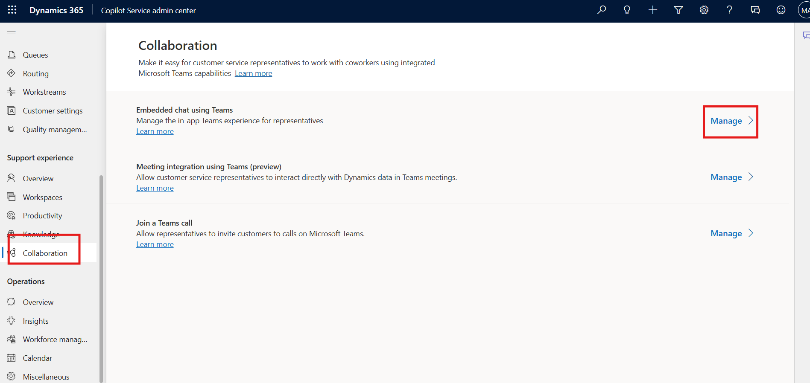

3.  To get suggested contacts for any record type, perform the
    following:

    - In **Connect chat to Dynamics 365 records**, select the record
      type **Case** for which you want to enable rules-based suggested
      contacts. The related settings pane appears on the right.

    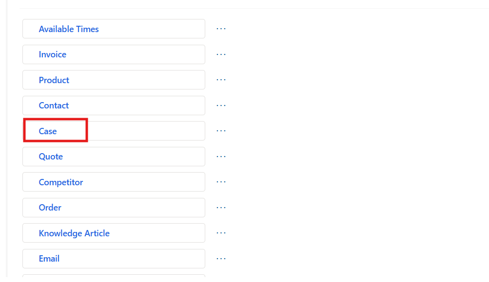

- In **Suggest contacts**, ensure the toggle for **Rules-based suggested
  contacts** is turned on. If it is already enabled and the **Save**
  option is inactive.

    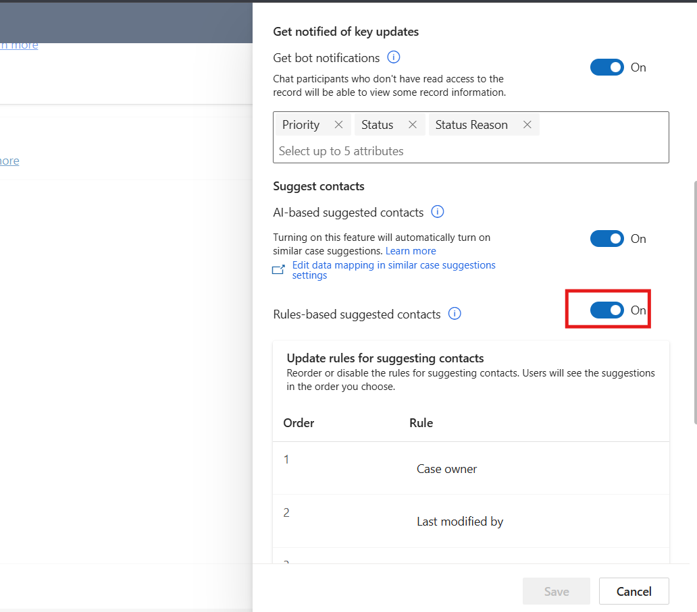

1.  In the **Update rules for suggesting contacts** section on the
    **Case** record, reorder or disable the rules for suggesting
    contacts. Users see the suggestions in the order you choose.

    - To reorder the rules, hover over a rule, and then select the up or
      down arrow to move the rules.

    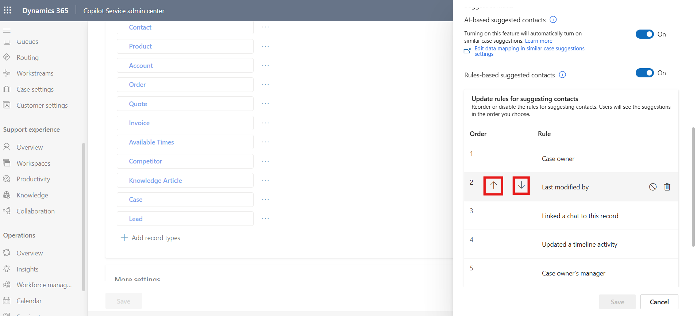

- To disable a rule, hover over a rule, and then select the disable
  icon. When the rule is disabled, a check mark is displayed when you
  hover over the disabled rule.

    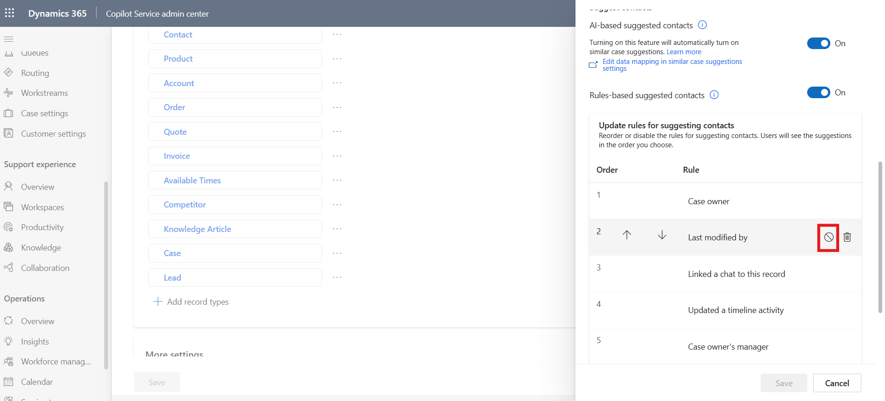

- To delete a rule, hover over the rule, and then select the delete
  icon. Deleting a rule removes it entirely so it won’t influence
  suggested contacts in the future.

    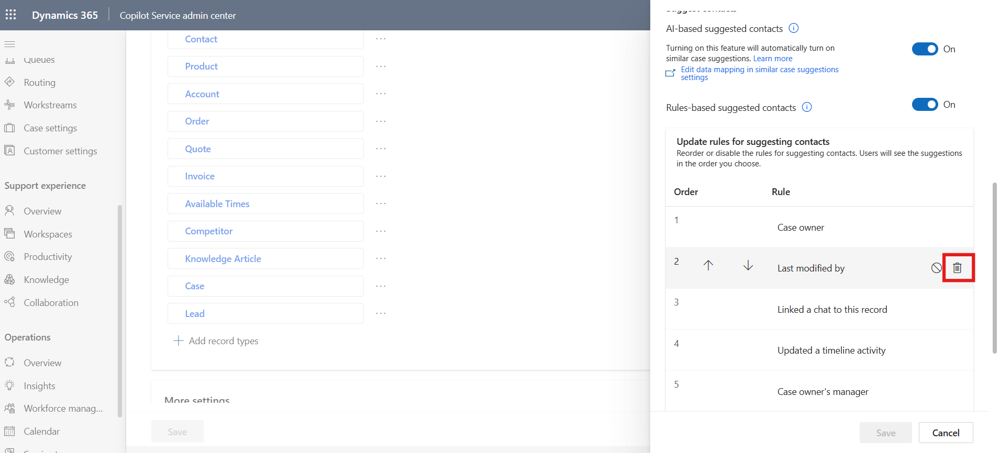

4.  Select **Save**.

## Task 2 - Add a new rule

1.  On the settings pane, in the **Update rules for suggesting
    contacts** section, select **Updates a timeline activity rule**.

2.  Delete the rule.

    

3.  From the bottom of the section, select **+ Add rule**.

    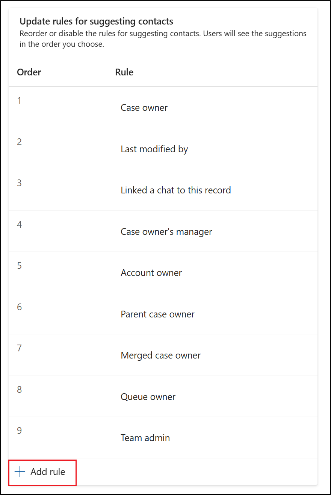

4.  The **Add rule** pane is displayed for the selected record type.

    

5.  Enter the following information:

    - **Rule name** - Created By

    - **Rule Type** - Relational

    - **Select a user or related record** - Created By

6.  Select **Save**.

    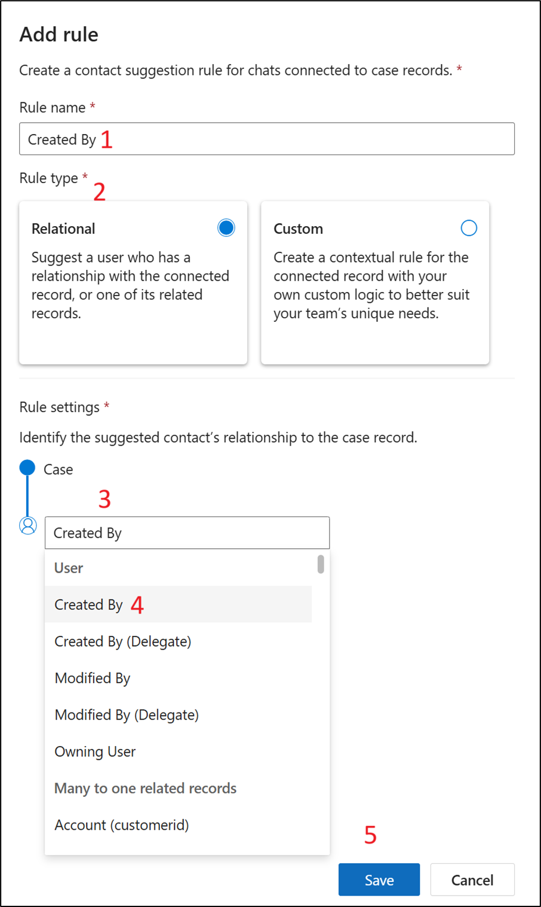

7.  A new rule is created. Select **Save** again.

    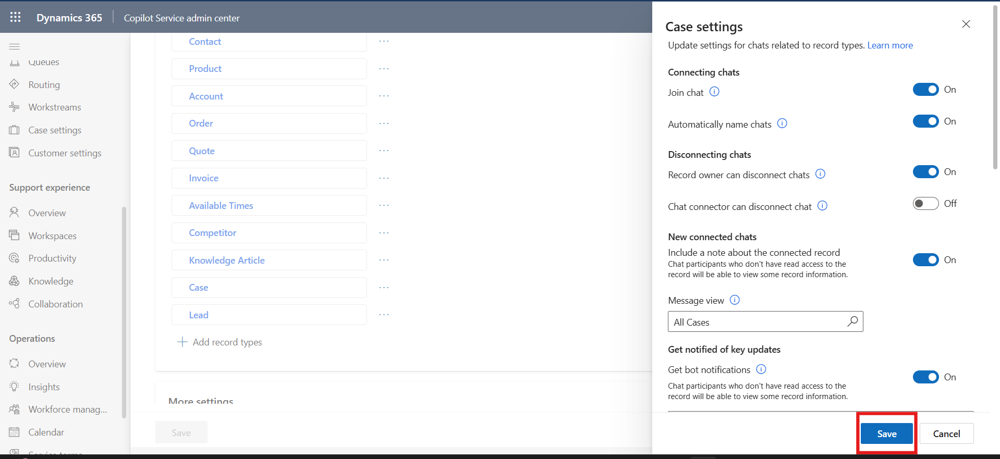

8.  Select **Save** on the **Microsoft Teams collaboration and chat**
    page.

    

# Conclusion

In this lab guide, you configured Microsoft Teams Chat collaboration and
suggested contact settings in Dynamics 365 Contact Center. You enabled
Microsoft Teams Chat integration, configured chat connections for record
types, managed disconnection and join settings, enabled AI-based
suggested contacts, and created a rules-based contact suggestion rule.
Together, these configurations help establish a more collaborative
support environment by connecting Dynamics 365 records with Microsoft
Teams-based communication and intelligent contact recommendations.
